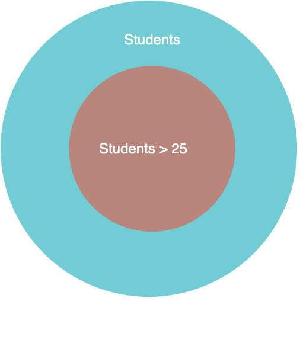
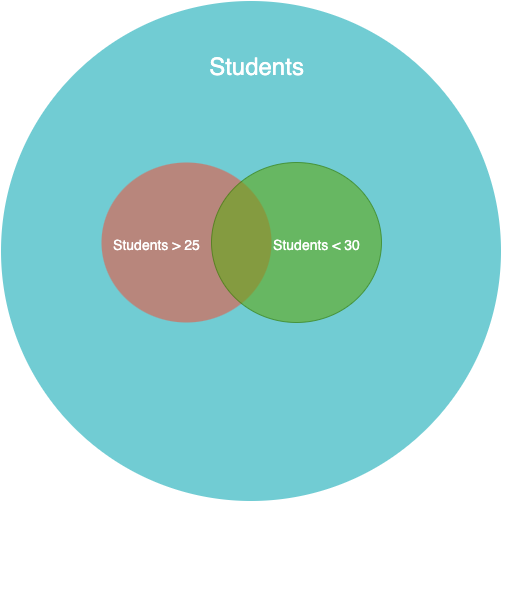

# Database and the relational model


## Agenda
* What is a database?
* Why do we use DBMS?
* What are the different types of databases?
* What is a relational database?

## Key terms
### Data
> **Information** or facts and statistics collected together for reference or analysis.

> **Information** that has been translated into a form that is efficient for movement or processing

Examples
* Runs scored by Virat Kohli
* Temperature in Bangalore
* Your food orders from Swiggy
* Students in a class

### Database
> an organized collection of **inter-related** data that models some aspect of the real-world

> a set of **related** data and the way it is organized

Examples
* Scorecards of all cricket matches
* Weather conditions of all cities in the world
* All orders placed on Swiggy
* Students, mentors and batches

### Database Management System
> software system that enables users to define, create, maintain and control access to the database

>  the software that manages a database

Examples
* MySQL
* PostgreSQL
* MongoDB
* Oracle
  
### Relational Database
> An approach to managing data using a structure and language consistent with first-order predicate logic, first described where all data is represented in terms of tuples, grouped into relations. A database organized in terms of the relational model is a relational database.

### Non-relational Database
> A non-relational database is a database that does not use the tabular schema of rows and columns found in most traditional database systems. Instead, non-relational databases use a storage model that is optimized for the specific requirements of the type of data being stored

> Non-relational databases (often called NoSQL databases) are different from traditional relational databases in that they store their data in a non-tabular form. Instead, non-relational databases might be based on data structures like documents. A document can be highly detailed while containing a range of different types of information in different formats

### Primary Key
> a specific choice of a minimal set of attributes (columns) that uniquely specify a tuple (row) in a relation (table)

### Foreign Key
> A foreign key is a set of attributes in a table that refers to the primary key of another table
---

## Brute Force - Files

Let us say it is 1960, and you haven't heard of databases.
Scaler is early on the scene, and they want to store the following data points
* Student (name, age, address, phone, email, etc.)
* Mentor (name, age, address, phone, email, etc.)
* Batch (name, mentor, start date, type, etc.)

What is the simplest way we can store this data?

**Files**
* Store each entity as a separate CSV file
  * students.csv
  * mentors.csv
  * batches.csv

### Sample students.csv
```csv
Name,Email,Phone,Age,Address
Tantia Tope,tantia@rani.bai,123456789,20,Jhansi
Kilvish,kil@vi.sh,987654321,21,Andhera
John Watson,i.am@sherlock.ed,123456789,30,221B Baker Street
```

or 

| Name        | Email            | Phone     | Age | Address           |
| ----------- | ---------------- | --------- | --- | ----------------- |
| Tantia Tope | tantia@rani.bai  | 123456789 | 20  | Jhansi            |
| Kilvish     | kil@vi.sh        | 987654321 | 21  | Andhera           |
| John Watson | i.am@sherlock.ed | 123456789 | 30  | 221B Baker Street |

Recap
* Store each entity as a separate CSV file
* The first row of each file is the header
* Header contains the attributes of the entity
* Each row except the header contains the data of the entity
* To read a record, the file needs to be parsed every time

### Issues - Can we use files for a real application?

First, let us see how we can interact with a file.
The following code will read the file and print name of the students.

```python
# Read file and print out name of students
with open(STUDENTS_FILE, "r") as file:
    for line in file:
        name = line.split(",")[0]
        print(name)
```
Can you spot an error in the output or the code?

Skipping the header row.
```python
# Read file and print just names of students
with open(STUDENTS_FILE, "r") as file:
    for index, line, in enumerate(file):
        if index == 0:
            continue
        name = line.split(",")[0]
        print(name)
```

#### How can I search for all the users whose age is less than 25?

* Read the file
* Iterate through each row
* Parse the row and check if the age is less than 25
* Print the name of the user if true


```python
# Read file and only print users with age less than 25
with open(STUDENTS_FILE, "r") as file:
    for index, line, in enumerate(file):
        if index == 0:
            continue
        name = line.split(",")[0]
        age = line.split(",")[3]
        if int(age) < 25:
            print(name, age)
```

#### Problems
* Not scalable - Inefficient
  * Worst case complexity is O(n)
  * We need to read the file every time we want to search for a user
  * We need to go through the file every time we want to search for a user
* Data integrity
  * What if there are duplicates in the file?
  * What happens if we replace the age of a student with a garbage value?
  * What happens if we delete a mentor that is part of a batch?
* Concurrency
  * What if two users update and save the file at the same time? Which value is saved?
* Security
  * Anyone with access to file system be able to read the file and even update it.
* Fault tolerance
  * What happens if computer crashes while you are updating the file?

### Recap
* Files are a simple way to store data
* To read even a single record, we need to parse the file every time
* Files are not scalable, secure or fault-tolerant
* When should we use a file?
  * Static data - Not frequently updated
  * Does not require complex operations like searching, updating, deleting, etc.
  * Small size of data
  * Fewer requests for the data - Less throughput
  * Configurations, log files, mock data, etc.

### Sequential vs Random Access


--- 
## DBMS
A database management systems aims to provide a single interface to a set of database services, that overcome the limitations of storing data in files.

> Codd proposed the following functions and services a fully-fledged general purpose DBMS should provide
> * Data storage, retrieval and update
> * User accessible catalog or data dictionary describing the metadata
> * Support for transactions and concurrency
> * Facilities for recovering the database should it become damaged
> * Support for authorization of access and update of data
> * Access support from remote locations
> * Enforcing constraints to ensure data in the database abides by certain rules

### Types of DBMS
* Relational
* Non-relational (NoSQL)
  * Columnar
    * > stores data tables by column rather than by row for more efficient access to data when only querying a subset of columns
    * MariaDB, InfluxDB
  * Graph-based
    * > graph structures with nodes, edges, and properties to represent and store information
    * Neo4j
  * Key-value
    * > uses a simple key-value method to store data where a key serves as a unique identifier. 
    * DynamoDB, Redis, etc.
  * Document-oriented
    * Extension of key-value database that stores data in a more complex structure which allows for optimisations for querying and storing data.
    * MongoDB, CouchDB, etc.
  * Time series
    * > to store and retrieve data records that are part of a “time series,” which is a set of data points that are associated with timestamps. The timestamps provide a critical context for each of the data points in how they are related to others.
    * InfluxDB, TimeScaleDB, Prometheus, etc.

--- 
### Relational DBMS

Using a database in an application leads to extra or boilerplate code. You might see the same piece of code across applications. To reduce this duplication and standardise the code, various data models were proposed.

The most popular being the relational model.
> The relational model (RM) is an approach to managing data using a structure and language consistent with first-order predicate logic, where all data is represented in terms of tuples, grouped into relations

> This relational model has three key points
> * Store database in simple data structures (relations).
> * Access data through high-level language.
> * Physical storage left up to implementation.

#### Relevance to DBMS

**SQL Query** 
```sql
SELECT * FROM USERS WHERE age > 25;
```

**Set operation - Subset**
<p align="center">
    
</p>

**SQL Query** 
```sql
SELECT * FROM USERS WHERE age > 25 and age < 30;
```

**Set operation - Subset**
<p align="center">
    
</p>

### Relational Model

Main features of the relational model are:
* **Relations** - Tables -Represent data as a collection of relations or tables
* **Attributes** - Columns - Each entry in a relation can describe multiple values that are grouped as an attribute 
* **Tuples** - Rows - Represent individual data points across multiple attributes


* **Degree** - Number of attributes in a relation 
  * > Student (name, age, address, phone, email)
  * Degree - 5
* **Cardinality** - Number of tuples
  * Look at our users file above
  * It has three rows and hence **cardinality is 3**
* **NULL** - For a given tuple, the attribute is undefined.

#### Properties
* **Uniqueness**
  * Each tuple is unique
  * Each attribute is unique
* **Unordered**
  * Tuples are not ordered
  * Attributes are not ordered
* **Uniform data type** - Every value in a column is of the same data type
* **Atomicity** -  Each attribute in each tuple within a relation should consist of a single value and not allow multivalued structures of the kind

--- 
### Keys
Keys are used to 
* uniquely identify a tuple in a relation.
* describe relationships between relations.

How can you uniquely identify a student in the students relation?
> Student (name, age, address, phone, email)

* Name
  * A name might not be unique
* Phone or Email
  * Each student will have a unique phone or email address

#### Super keys

A set of attributes that uniquely identify a tuple in a relation.

For our student relation `Student (name, age, address, phone, email)`, following are some super keys:
* `{id, name}`
* `{id, name, phone}`
* `{id, name, email}`
* `{id, name, email, phone}`
* `{id, name, email, phone, age, address}`
* `{id}`

#### Candidate keys

A **minimal** set of attributes that uniquely identify a tuple in a relation.

For example `{id, name, email, phone}` is a super key but is it a candidate key?

**No**, since you can remove `phone` or any other attribute set, but it will still uniquely identify a tuple.

A set of candidate keys for our student relation
* id
* phone
* email

#### Primary Keys
> a specific choice of a minimal set of attributes (columns) that uniquely specify a tuple (row) in a relation (table)

> a primary key is a choice of candidate key (a minimal superkey); any other candidate key is an alternate key.

**Each relation can only have one primary key**

#### Composite Keys
Sometime you want to use multiple attributes to uniquely identify a tuple. For example, you might want to use a combination of name and phone number to uniquely identify a student.

Composite keys are used in mapping tables. For instance, you might want to have a relation for student feedback.
You could use `student_id` and `batch_id` for uniquely identifying a tuple.

#### Foreign Keys
> A Foreign Key is a database key that is used to link two tables together
> A foreign key is a set of attributes in a table that refers to the primary key of another table

Imagine adding a batch to a student.
You could add all the column for a batch in the student relation.

| Name | Email | Phone | Age | Address | Batch Name | Batch | Start Date | Type |
| ---- | ----- | ----- | --- | ------- | ---------- | ----- | ---------- | ---- |

Problem with this solution
* Duplication - All the columns from the batch relation are duplicated
* Integrity - What if the original relation is duplicated?

Can we just reference the original relation?
| Name | Email | Phone | Age | Address | Batch Id |
| ---- | ----- | ----- | --- | ------- | -------- |

## Some queries to get you started
Create the students relation
```sql
CREATE TABLE `students` (
  `id` int NOT NULL AUTO_INCREMENT,
  `name` varchar(255) NOT NULL,
  `age` int DEFAULT NULL,
  `phone` int DEFAULT NULL,
  `email` varchar(255) NOT NULL,
  `address` varchar(255) DEFAULT NULL,
  PRIMARY KEY (`id`);
)
```

Create the mentors relation
```sql
CREATE TABLE `mentors` (
  `id` int NOT NULL AUTO_INCREMENT,
  `name` varchar(255) NOT NULL,
  `age` int DEFAULT NULL,
  `phone` int DEFAULT NULL,
  `address` varchar(255) DEFAULT NULL,
  `email` varchar(255) NOT NULL,
  PRIMARY KEY (`id`)
);
```

Create the batches relation
```sql
CREATE TABLE `batches` (
  `id` int NOT NULL AUTO_INCREMENT,
  `name` varchar(255) NOT NULL,
  `start_date` timestamp NOT NULL DEFAULT CURRENT_TIMESTAMP,
  `type` varchar(255) NOT NULL,
  `mentor_id` int NOT NULL,
  PRIMARY KEY (`id`),
  KEY `mentor_id` (`mentor_id`),
  CONSTRAINT `batches_ibfk_1` FOREIGN KEY (`mentor_id`) REFERENCES `mentors` (`id`)
);
```
