# Data Integrity and ER Diagrams


## Agenda
* Database Schema
* Data Integrity
* ER Diagrams

## Key Terms
### Schema
> refers to the organization of data as a blueprint of how the database is constructed

> In a relational database, the schema defines the tables, fields, relationships, views, indexes, packages, procedures, functions, queues, triggers, types, sequences, materialized views, synonyms, database links, directories, XML schemas, and other elements

### Data Integrity
> is the overall accuracy, completeness, and consistency of data
> the maintenance of, and the assurance of, data accuracy and consistency over its entire life-cycle
### ER Diagrams
> An entity–relationship model (or ER model) describes interrelated things of interest in a specific domain of knowledge. A basic ER model is composed of entity types (which classify the things of interest) and specifies relationships that can exist between entities (instances of those entity types)

## Schema
A schema is a blueprint of a database. It is created before you actually construct the database so that the schema design can be reviewed. Schema diagrams are also a great way to document the database structure in one place.

Remember our student's database from the [previous lesson](01-database-fundamentals.md)? We had the three following tables
* `students` (id, name, age, address, phone, email, batch ID)
* `mentors` (id, name, age, address, phone, email)
* `batches` (id, name, mentor, start date, type, mentor ID)

So each table has `ID` as primary key. The `students` table has a `batch ID` field that references the `batches` table and the `batches` table has a `mentor ID` field that references the `mentors` table. These are examples of foreign keys. These are some the items that are present in a schema. A schema will also contain indexes, constraints, and other items that are present in a table.

Following is a schema diagram for the above database. Note that the primary key is not highlighted here, which ideally should be.

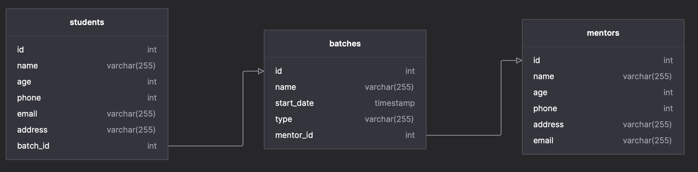

> **Note**
>
> Try it yourself. \
> Go to [this](https://diagramplus.com/) website and import [this](../media/schema.diagram) diagram. \
> Try adding a new column or even a new table.

---
## Data Integrity
Remember when we stored our data in [files](01-database-fundamentals.md#brute-force---files)? That was the simplest way to store data, but it had a lot of issues. One of the major issues was that we can never be sure that our data is consistent with the way we want it to be.

Some issues that we can encounter are
* Duplicate rows - multiple rows with the same data
* A string in a field where a number is expected, or vice versa.
* Updating or deleting a mentor that has batches assigned to it
* Entering 20 digits as a phone number instead of a 10-digit phone number

This is where DBMS excels. Data integrity is normally enforced in a database system by a series of integrity constraints or rules.
Data integrity (or actually logical integrity) can be divided into three main categories:

### Entity integrity
Each row to be unique within its table. No two rows can be the same. To achieve this, a **primary key** can be defined.

The primary key field contains a unique identifier – no two rows can contain the same unique identifier.

> Every table must have a primary key and that the column or columns chosen to be the primary key should be unique and not null

Let us try it out on our database. Following is the `students` table.

```sql
SELECT
    *
FROM
    students;
```
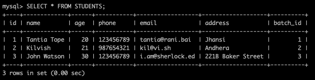

Let us now try to insert a duplicate row in our database. Since our PK is `id`, we will have to manually add a duplicate value. 

```sql
INSERT INTO STUDENTS (id,name,age,phone,email,address,batch_id)
    VALUES (3,"John Watson",30,123456789,"i.am@sherlock.ed","221B Baker Street", 3);
```
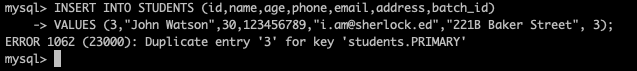

As you can see, the database does not allow us to insert a duplicate row.


### Referential integrity
> Referential integrity is a property of data stating that all its references are valid.

When a foreign key value is used it must reference a valid, existing primary key in the parent table.
For referential integrity to hold in a relational database, any column in a base table that is declared a foreign key can only contain either **null values or values from a parent table's primary key or a candidate key**.

>  For instance, deleting a record that contains a value referred to by a foreign key in another table would break referential integrity.

> The referential integrity rule states that any foreign-key value can only be in one of two states. The usual state of affairs is that the foreign-key value refers to a primary key value of some table in the database. The other being NULL which means no relationship exists.

Let us try it on our students table again. The table is the same as above.


We'll now try to enter a tuple which has a batch ID that does not exist in the batches table.
```sql
INSERT INTO STUDENTS (id,name,age,phone,email,address,batch_id)
    VALUES (4,"Zuck",30,123456789,"zuck@givemedata.com","someverse", 4);
```
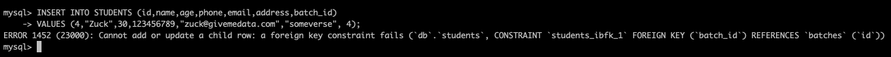
> **Note**
> Additionally, MySQL requires that the referenced columns be indexed for performance reasons. However, the system does not enforce a requirement that the referenced columns be UNIQUE or be declared NOT NULL.

### Domain integrity
> all columns in a relational database must be declared upon a defined domain

Domain integrity concerns the validity of entries for a given column. For instance, if a column is declared to be of type `INTEGER`, then only integers can be entered.

Another example is if a column has a `NOT NULL` constraint, then it cannot be null.

> Each attribute in the model should be assigned domain information which includes:
> * **Data Type** - Basic data types are integer, decimal, or character. Most data bases support variants of these plus special data types for date and time.
> * **Length** - This is the number of digits or characters in the value. For example, a value of 5 digits or 40 characters.
> * **Date Format** - The format for date values such as dd/mm/yy or mm/dd/yyyy or yy/mm/dd.
> * **Range** - The range specifies the lower and upper boundaries of the values the attribute may legally have.
> * **Constraints** - Are special restrictions on allowable values. For example, the LeavingDate for an Employee must always be greater than the HireDate for that Employee.
> * **Null support** - Indicates whether the attribute can have null values.
> * **Default value** (if any) - The value an attribute instance will have if a value is not entered.

Let us try to enter a tuple with a `phone` field that is not an integer but a string. Following is our students table and the result of the query.
```sql
INSERT INTO STUDENTS (id,name,age,phone,email,address,batch_id)
    VALUES (4,"Zuck",30,123456789,"zuck@givemedata.com","someverse",NULL);
```
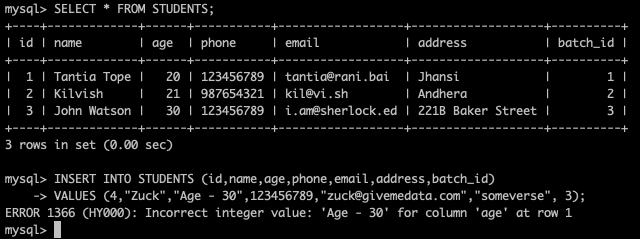

---

## ER Models and Diagrams
> "ER model" is short for "entity-relationship model," a high-level data model. As the name suggests, a data model depicts how a database is structured at a logical and visual level. In layman's terms, an ER model defines the elements and their relationship in a specific database. It's like a "blueprint" to your database, providing a simple view of the data.


> Entity-relationship diagrams, also called ERDs or ER diagrams, are flowchart-like diagrams that explain the structure of entities, attributes, and their relationships in a database


### Entity

Entities represent a collection of data, using a rectangle with attributes ‘hanging’ off it, or box containing a list of its attributes.

> An entity is something that is present in an organization or institute and needs to be represented in the database. They are primarily nouns such as customer, location, concept, event, or person. They are essential for the representation of data. These entities are made of attributes which in turn represent the entity.


```mermaid
erDiagram
    STUDENT
    MENTOR
    BATCH
    CLASS
```

### Attributes
> An attribute is a characteristic related to the entity. These characteristics are used to understand the database in more detail and depth.


Types of attributes
* Simple - Only has a **single value**
* Key - **Unique identifier** for a tuple
* Derived - Value can be **derived from another attribute** 
* Multi-valued - Can take **more than one value**
* Composite - Consists of **two or more sub-attributes**

Attributes in an ERD are represented by ellipses connected to the rectangular entity box. The various types of attributes and their visualisation is as follows:
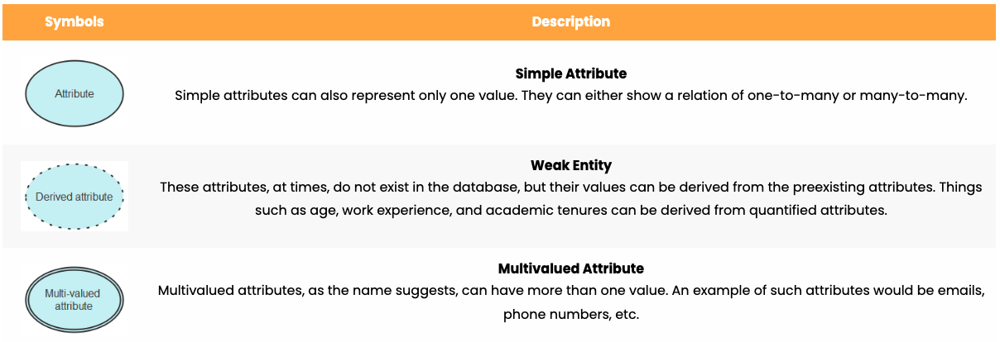

Our `student` entity will look as follows

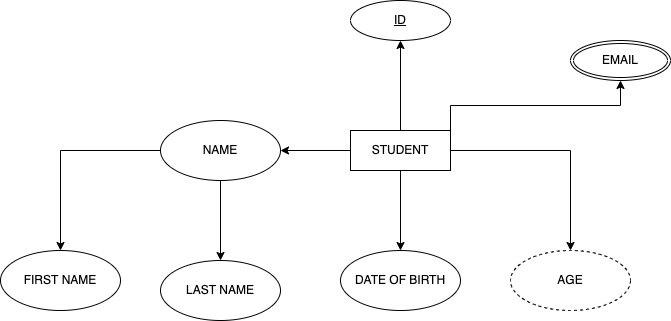


An alternate way of visualising attributes which is much similar to UML class diagrams
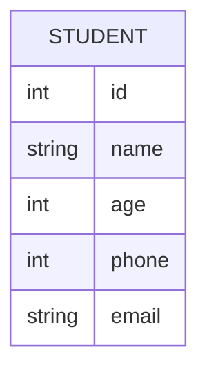
### Relationships
> A relationship is a connection between two entities, such as a student who goes to a school or an employee who works for a company. In the first case, "student" and "school" are two different entities linked by a relationship. Similarly, in the latter case, "employee" and "company" are two entities, and the relationship is "works for."


#### Cardinality
> Cardinality is the maximum times an entity can relate to an instance with another entity or entity set.

> the number of interactions entities have with each other.

**One to One (1:1)**
>  A "one-to-one" relationship is seen when one instance of entity 1 is related to only one instance of entity 2 and vice-versa

A student can only have one email address and one email address can be associated with only one student.


An attribute shared by both entities can be added to either of the entities.

**One to Many or Many to one (1:m or m:1)**
> When one instance of entity 1 is related to more than one instance of entity 2, the relationship is referred to as "one-to-many.

A student can only be associated with one batch, but a batch can have many students.

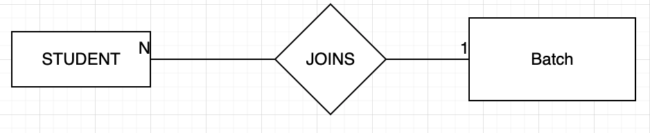

An attribute shared by both entities can only be added to the entity which has multiple instances i.e. the M side.

**Many to Many (m:n)**

> When multiple instances of entity 1 are linked to multiple instances of entity 2, we have a "many-to-many" relationship. Imagine a scenario where an employee is assigned more than one project.

A student can attend multiple classes and a class can have multiple students.

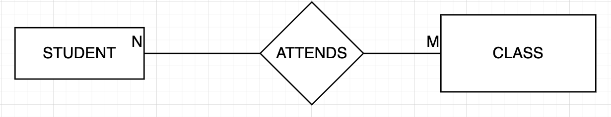

An attribute shared by both entities has to be added to the relationship.

#### Example
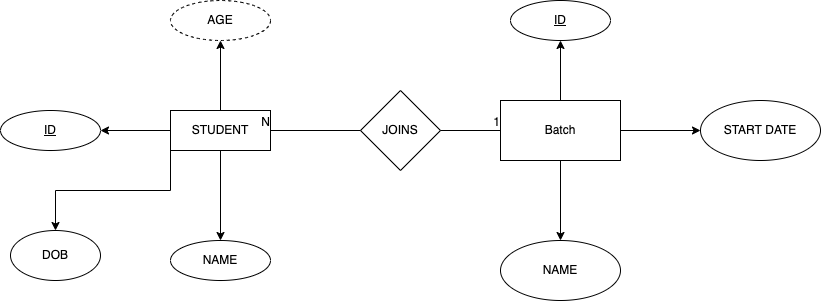

---
## References
* [Data Integrity](https://en.wikipedia.org/wiki/Data_integrity)
* [What is data integrity?](https://database.guide/what-is-data-integrity/)
* [ERD Primer](https://arctype.com/blog/er-diagram/)
* [ERD with draw.io](https://drawio-app.com/entity-relationship-diagrams-with-draw-io/)

## Reading List
* [Data Integrity with MySQL](http://download.nust.na/pub6/mysql/tech-resources/articles/mysql-data-integrity.html)
* [ERD with Mermaid](https://mermaid-js.github.io/mermaid/#/entityRelationshipDiagram)
