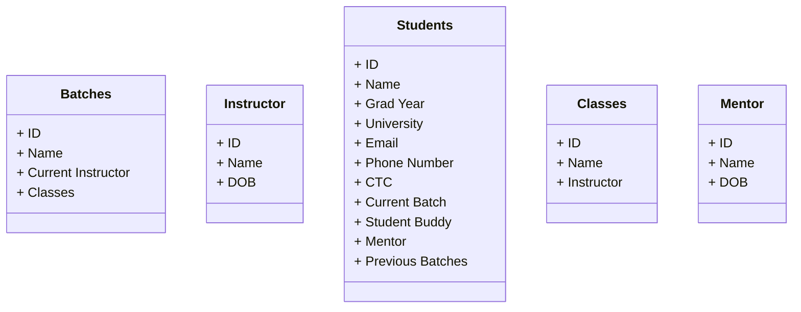
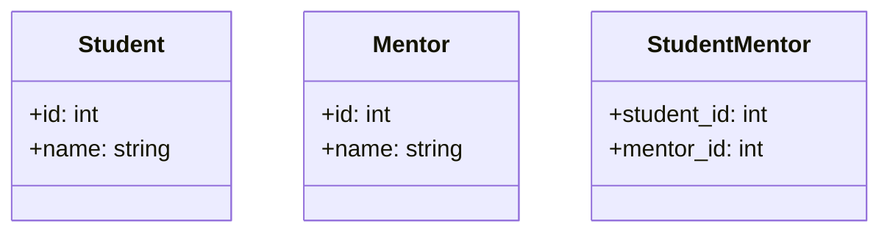
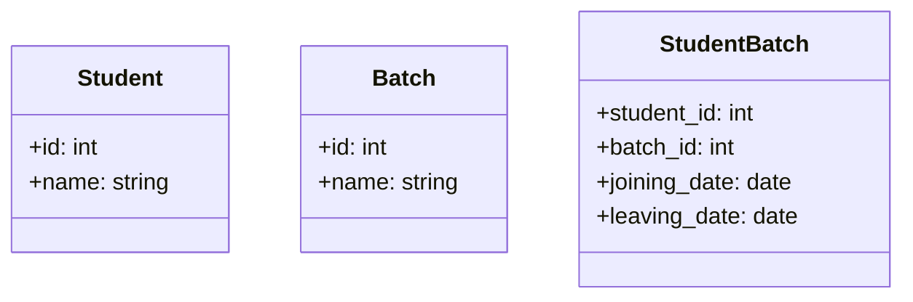
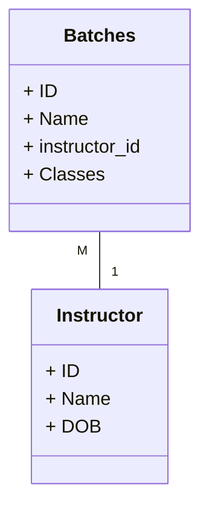
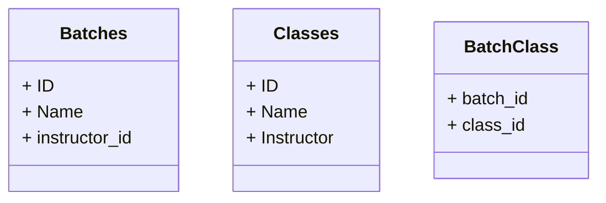
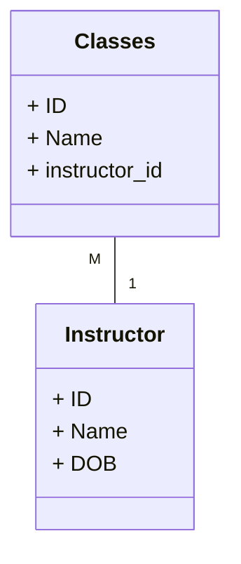
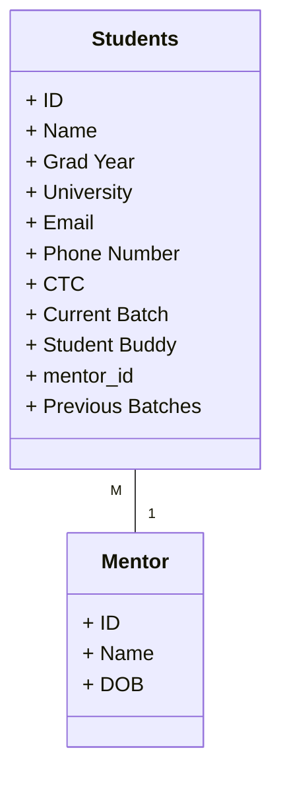
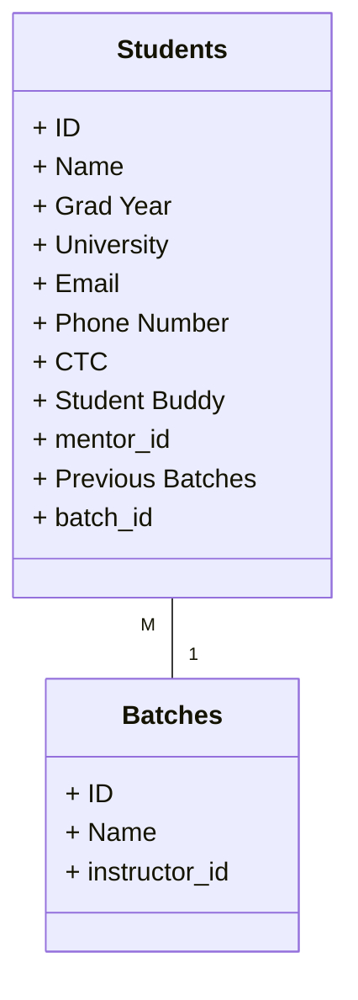
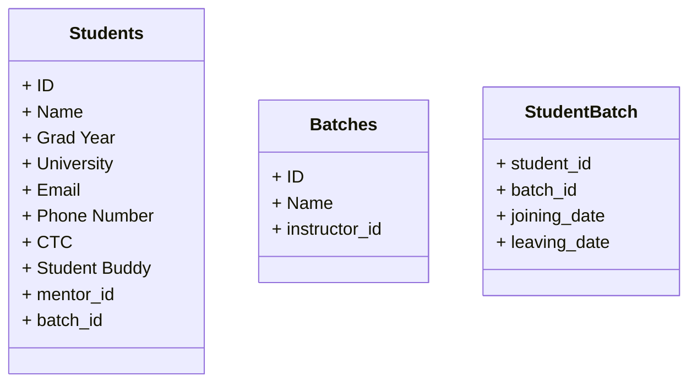
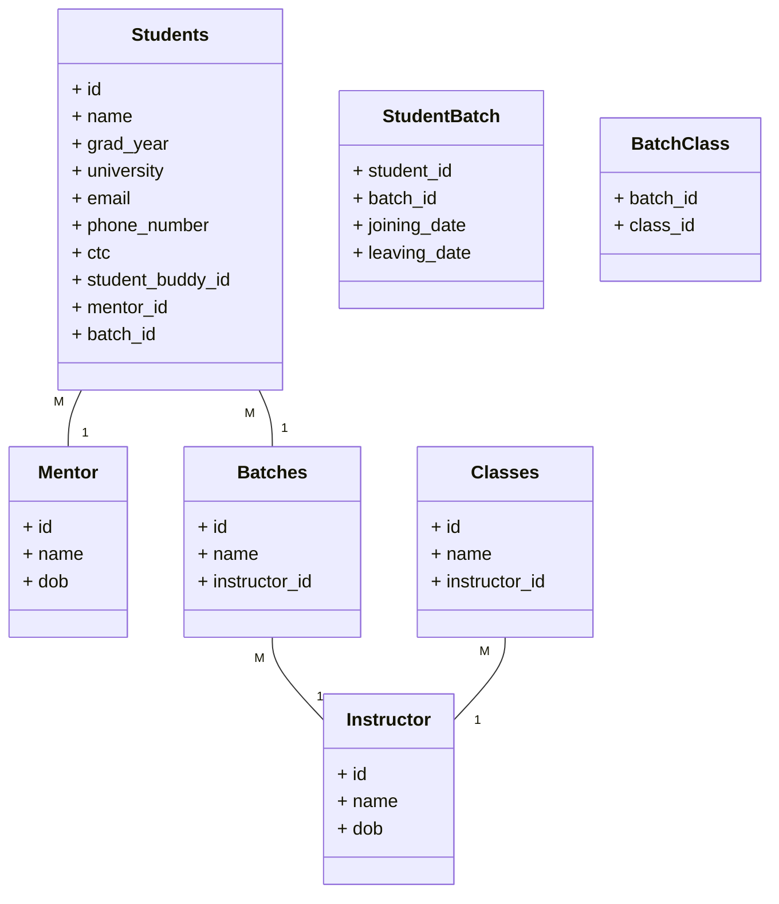

# Schema Design: A case study

- [Schema Design: A case study](#schema-design-a-case-study)
  - [Key Terms](#key-terms)
    - [Schema](#schema)
  - [SQL data types](#sql-data-types)
    - [String types](#string-types)
    - [Numeric types](#numeric-types)
  - [Schema design](#schema-design)
    - [Case study: Requirements](#case-study-requirements)
    - [Initial design](#initial-design)
    - [Cardinality](#cardinality)
      - [Caveat 1: NULL values](#caveat-1-null-values)
      - [Caveat 2: Relations with attributes](#caveat-2-relations-with-attributes)
      - [Recap](#recap)
    - [Final Design](#final-design)
  - [Reading list](#reading-list)

## Key Terms
### Schema
> refers to the organization of data as a blueprint of how the database is constructed

> In a relational database, the schema defines the tables, fields, relationships, views, indexes, packages, procedures, functions, queues, triggers, types, sequences, materialized views, synonyms, database links, directories, XML schemas, and other elements

## SQL data types

MySQL supports SQL data types in several categories: numeric types, date and time types, string (character and byte) types, spatial types, and the JSON data type. The following are the string and numeric types:

### String types

| Type | Description | Size | Range | Example |
| --- | --- | --- | --- | --- |
| `CHAR(n)` | Fixed-length string | 0-255 | 0-65,535 | `CHAR(10)` |
| `VARCHAR(n)` | Variable-length string | 0-255 | 0-65,535 | `VARCHAR(10)` |
| `TINYTEXT` | Variable-length string | 0-255 | 0-65,535 | `VARCHAR(10)` |
| `TEXT` | Variable-length string | 0-65,535 | 0-4,294,967,295 | `TEXT` |
| `MEDIUMTEXT` | Variable-length string | 0-16,777,215 | 0-4,294,967,295 | `MEDIUMTEXT` |
| `LONGTEXT` | Variable-length string | 0-4,294,967,295 | 0-4,294,967,295 | `LONGTEXT` |

### Numeric types

| Type | Description | Size | Range | Example |
| --- | --- | --- | --- | --- |
| `TINYINT` | Integer | 1 byte | -128 to 127 | `TINYINT` |
| `SMALLINT` | Integer | 2 bytes | -32,768 to 32,767 | `SMALLINT` |
| `MEDIUMINT` | Integer | 3 bytes | -8,388,608 to 8,388,607 | `MEDIUMINT` |
| `INT` | Integer | 4 bytes | -2,147,483,648 to 2,147,483,647 | `INT` |
| `BIGINT` | Integer | 8 bytes | -9,223,372,036,854,775,808 to 9,223,372,036,854,775,807 | `BIGINT` |
| `DECIMAL` | Fixed-point number | 0-65 | -10^38+1 to 10^38-1 | `DECIMAL(10, 2)` |
| `FLOAT` | Floating-point number | 4 bytes | -3.402823466E+38 to -1.175494351E-38, 0, and 1.175494351E-38 to 3.402823466E+38 | `FLOAT` |

## Schema design

A schema is a blueprint of a database. It is created before you actually construct the database so that the schema design can be reviewed. Schema diagrams are also a great way to document the database structure in one place.

Remember our student's database from the [previous lesson](01-database-fundamentals.md)? We had the three following tables
* `students` (id, name, age, address, phone, email, batch ID)
* `mentors` (id, name, age, address, phone, email)
* `batches` (id, name, mentor, start date, type, mentor ID)

So each table has `ID` as primary key. The `students` table has a `batch ID` field that references the `batches` table and the `batches` table has a `mentor ID` field that references the `mentors` table. These are examples of foreign keys. These are some the items that are present in a schema. A schema will also contain indexes, constraints, and other items that are present in a table.

Following is a schema diagram for the above database. Note that the primary key is not highlighted here, which ideally should be.

> **Note**
>
> Try it yourself. \
> Go to [this](https://diagramplus.com/) website and import [this](../media/schema.diagram) diagram. \
> Try adding a new column or even a new table.

### Case study: Requirements

* There are several batches at Scaler. Each batch has an ID, name, current instructor.
* Each batch has multiple classes. Each class has an ID, name, instructor
* Every Student has a name, ID, grad year, university, email, phone number, ctc, current batch.
* Every student also has a student buddy. 
* A student may have been moved from one batch to another due to pausing the course. So we need to know the entry date and leaving date of a student on every batch they were a part of..
* Every student has a mentor. Every mentor has a name, dob.

You can also find these [here](https://docs.google.com/document/d/1uNhwSuzskCa_mw4TECtGfHFl8C6bxSHuystu99rST3A/edit).

### Initial design
The first step of designing a schema is to identify the entities. 
This can be done by identifying the nouns in the requirements.
For example, take the first requirement.
> There are several batches at Scaler. Each batch has an ID, name, current instructor.

We can identify the following entities:
* Batches
* Instructor

Running through the requirements, we can identify the following entities:
* Batches
* Instructor
* Students
* Classes
* Mentor

The next step would be to identify the attributes of each entity. For example, the `Batches` entity has the following attributes:
* ID
* Name
* Current Instructor
* Classes

The initial set of tables would look like this:

The initial design has the following issues:
* Foreign keys are not present
* Attributes are not atomic
* There is no way to know the entry and leaving date of a student on a batch

The next step would be to identify the relationships between the entities to add the foreign keys. To identify relationships, we need to find the cardinality of the relations.

### Cardinality
> Cardinality is the maximum times an entity can relate to an instance with another entity or entity set.

> the number of interactions entities have with each other.

**One to One (1:1)**
>  A "one-to-one" relationship is seen when one instance of entity 1 is related to only one instance of entity 2 and vice-versa

A student can only have one email address and one email address can be associated with only one student.

An attribute shared by both entities can be added to either of the entities.

**One to Many or Many to one (1:m or m:1)**
> When one instance of entity 1 is related to more than one instance of entity 2, the relationship is referred to as "one-to-many.

A student can only be associated with one batch, but a batch can have many students.

An attribute shared by both entities can only be added to the entity which has multiple instances i.e. the M side.

**Many to Many (m:n)**

> When multiple instances of entity 1 are linked to multiple instances of entity 2, we have a "many-to-many" relationship. Imagine a scenario where an employee is assigned more than one project.

A student can attend multiple classes and a class can have multiple students.

An attribute shared by both entities has to be added to the relationship.

#### Caveat 1: NULL values

Often, when a relationship is not present, we use `NULL` values. For example, a student may not have a mentor. In this case, the `mentor_id` field in the `students` table will be `NULL`. This is a valid value for a foreign key.

If a table has a lot of NULL values for a foreign key, it is a good idea to create a new mapping table. For example, a student can have a `mentor_id` field with NULL values, we can create a new table `student_mentor`:

#### Caveat 2: Relations with attributes

Sometimes, a relationship has attributes. For example, a student can have multiple batches. In this case, we can add a `joining_date` and `leaving_date` field to the `student_batch` table.

If the relation attributes are added to the main table, it can get polluted and add to the latency of the table. A better approach is to create a new table with the relation attributes.

#### Recap

| Cardinality | Normal Relation | Sparse Relation | Relation with Attributes | Example |
| --- | --- | --- | --- | --- |
| 1:1 | Add foreign key on any table | Mapping Table | Mapping Table | Student - Email |
| 1:M |  Add foreign key on M side referencing the other| Mapping Table | Mapping Table | Student - Batch |
| M:N | Mapping Table | Mapping Table | Mapping Table | Student - Class |

### Final Design

Now that we know about cardinality, we can go ahead and identify the various relationships between the entities.

* A batch and an instructor have a Many to One relationship. An instructor can teach multiple batches, but a batch can only have one instructor. So we add a foreign key `instructor_id` to the `batches` table.

* A batch can have multiple classes and a class can be a part of multiple batches i.e. Many to Many relationship. So we create a mapping table `batch_classes` with the attributes `batch_id` and `class_id`.

* A class can have one instructor and an instructor can teach multiple classes i.e. Many to One relationship. So we add a foreign key `instructor_id` to the `classes` table.

* A student can have one mentor and a mentor can have multiple students i.e. Many to One relationship. So we add a foreign key `mentor_id` to the `students` table.

* A student can be a part of only one batch at a time, but a batch can have multiple students i.e. Many to One relationship. So we add a foreign key `batch_id` to the `students` table.

* A student can have multiple previous batches and a batch can have multiple students i.e. Many to Many relationship. So we create a mapping table `student_batch` with the attributes `student_id` and `batch_id`. Also, we need to store the `joining_date` and `leaving_date` for each student-batch relationship.

The complete final design is as follows:

## Reading list
* [Problems with floats](https://dev.mysql.com/doc/refman/8.0/en/problems-with-float.html)
* [Char and Varchar](https://dev.mysql.com/doc/refman/8.0/en/char.html)
* [IEEE 754 - Floating Point Arithmetic](https://en.wikipedia.org/wiki/IEEE_754)