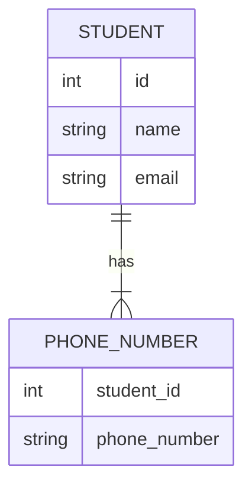
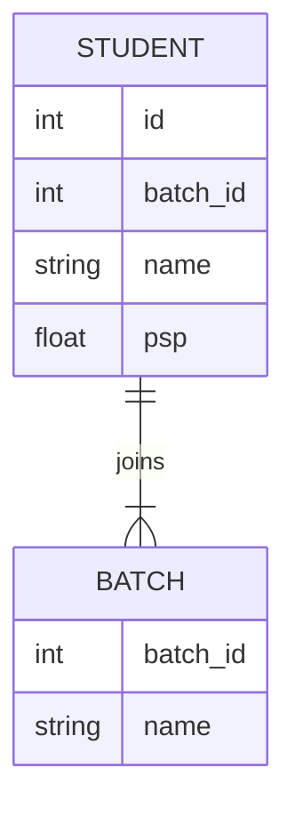
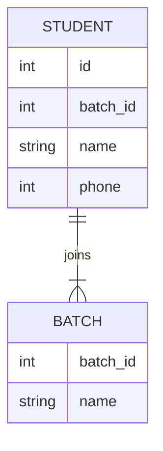
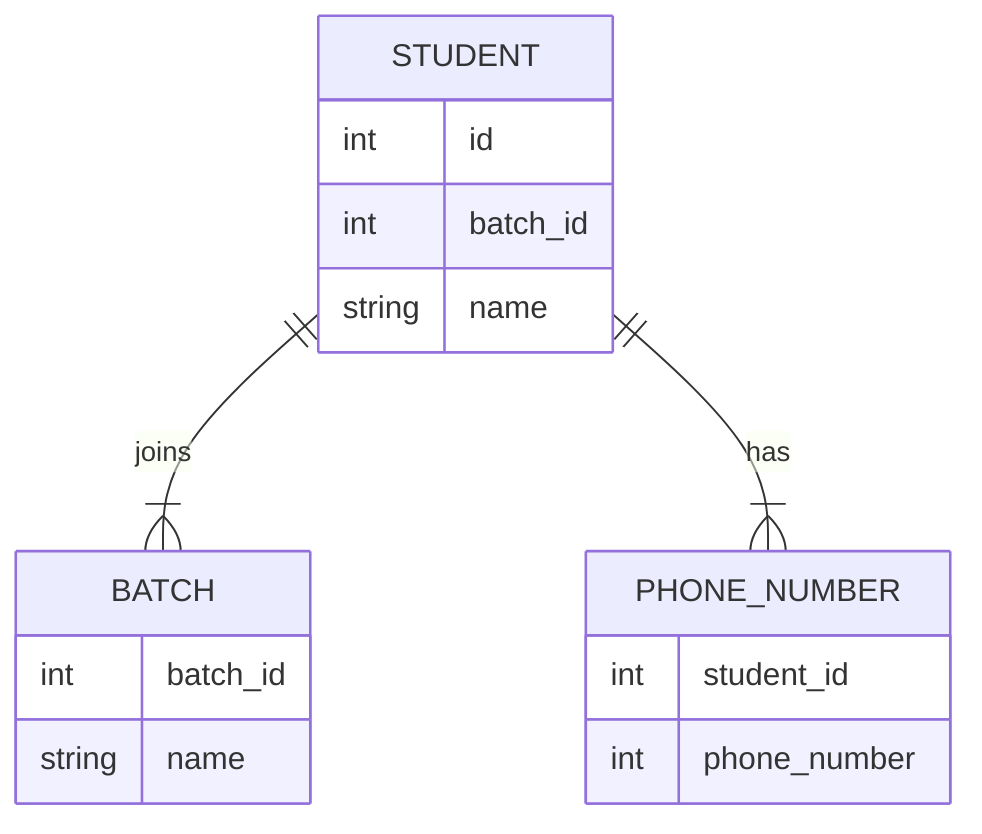

# Normalisation and SQL CRUD operations

- [Normalisation and SQL CRUD operations](#normalisation-and-sql-crud-operations)
  - [Key Terms](#key-terms)
    - [Functional Dependencies](#functional-dependencies)
    - [Data Normalisation](#data-normalisation)
  - [Data Anomalies](#data-anomalies)
    - [Insertion Anomalies](#insertion-anomalies)
    - [Deletion Anomalies](#deletion-anomalies)
    - [Updation Anomalies](#updation-anomalies)
  - [Functional Dependencies](#functional-dependencies-1)
  - [Data Normalisation](#data-normalisation-1)
    - [1NF](#1nf)
      - [Redundant columns](#redundant-columns)
      - [Redundant rows](#redundant-rows)
      - [Separate Mapping Table](#separate-mapping-table)
    - [2NF](#2nf)
    - [3NF](#3nf)
    - [Boyce-Codd Normal Form (BCNF)](#boyce-codd-normal-form-bcnf)
  - [SQL Commands](#sql-commands)
    - [DDL](#ddl)
    - [DML](#dml)
    - [DCL](#dcl)
    - [TCL](#tcl)
  - [CRUD with SQL](#crud-with-sql)
    - [Create rows](#create-rows)
      - [Examples](#examples)
    - [Read rows](#read-rows)
      - [Examples](#examples-1)
  
## Key Terms

### Functional Dependencies
> Functional Dependency is when one attribute determines another attribute in a DBMS
### Data Normalisation
> the process of splitting relations into well-structured relations that allow users to insert, delete, and update tuples without introducing database inconsistencies

## Data Anomalies

> An anomaly is something that is unusual or unexpected; an abnormality

A very common source for issues in the database is redundancy. Apart from storage issues, having the same value present in multiple rows can lead to inconsistent data. Have a look at the following `STUDENTS` table.

| <u>ID</u> | NAME | EMAIL | BATCH_ID | BATCH_NAME |
| --------- | ---- | ----- | -------- | ---------- |

Let us assume that the above table is the only table in the database.
The student and batch entities are tightly coupled. What are some issues that can be caused by this?

* How do we create a new batch without students?
* How do we create a new student without a batch?
* What data do we lose if we delete a student?
* What happens if we modify a batch name but miss a record?

Anomalies are avoided by the process of normalisation
The above issues or anomalies can be categorised into the following categories:

### Insertion Anomalies
> The inability to insert a new tuple into a table due to missing data is known as insertion anomaly.

> An insertion anomaly occurs when data cannot be inserted into a database due to other missing data

This is most common for fields where a foreign key must not be NULL, but lacks the appropriate data
Adding a student without a batch is not possible in the above schema is a batch_id is required.
Whereas creating a new batch without students would require multiple null values and special handling.

### Deletion Anomalies
> A deletion anomaly occurs when data is unintentionally lost due to the deletion of other data
> A deletion anomaly is the unintended loss of data due to deletion of other data

| <u>ID</u> | NAME        | EMAIL         | BATCH_ID | BATCH_NAME        |
| --------- | ----------- | ------------- | -------- | ----------------- |
| 1         | John Watson | j@sherlock.ed | 1        | Sherlock Season 6 |
| 2         | Mary Watson | m@sherlock.ed | 1        | Sherlock Season 6 |
| 3         | Kilvish     | kil@vi.sh     | 2        | Shaktimaan        |

In the above table, just `Kilvish` is associated with the batch `Shaktimaan`.
Now, if we delete `Kilvish` from the database, we lose the data associated with the batch.
This results in database inconsistencies and is an example of how combining information that does not really belong together into one table can cause problems

### Updation Anomalies
> An update anomaly occurs when data is only partially updated in a database
> An update anomaly is a data inconsistency that results from data redundancy and a partial update


| <u>ID</u> | NAME           | EMAIL               | BATCH_ID | BATCH_NAME        |
| --------- | -------------- | ------------------- | -------- | ----------------- |
| 1         | John Watson    | j@sherlock.ed       | 1        | Sherlock Season 6 |
| 2         | Mary Watson    | m@sherlock.ed       | 1        | Sherlock Season 6 |
| 3         | Kilvish        | kil@vi.sh           | 2        | Shaktimaan        |
| 4         | Mycroft Holmes | brother@sherlock.ed | 1        | Sherlock Season 6 |

In the above table, we have three students associated with the batch `Sherlock Season 6`.
If we have to update the batch name, each row will have to be updated due to redundancy.
This adds an overhead and a likely source of data inconsistency. If our developer or query misses a record, the database will be in an inconsistent state.

## Functional Dependencies
> a dependency FD: X → Y means that the values of Y are determined by the values of X. Two tuples sharing the same values of X will necessarily have the same values of Y.

* A functional dependency is a constraint that specifies the relationship between two sets of attributes where one set can accurately determine the value of other sets.
* It is denoted as `X → Y`, where X is a set of attributes that is capable of determining the value of Y
* The attribute set on the left side of the arrow, X is called Determinant, while on the right side, Y is called the Dependent

> Suppose one is designing a system to track vehicles and the capacity of their engines. Each vehicle has a unique vehicle identification number (VIN).
> One would write **VIN → EngineCapacity** because it would be inappropriate for a vehicle's engine to have more than one capacity. 
> On the other hand, EngineCapacity → VIN is incorrect because there could be many vehicles with the same engine capacity

| <u>ID</u> | NAME | EMAIL | BATCH_ID | BATCH_NAME |
| --------- | ---- | ----- | -------- | ---------- |

Using the above schema, the following observations can be made:
* `ID` can be used to derive `NAME` and `EMAIL`. Hence,
  * `ID → NAME`
  * `ID → EMAIL`
* `BATCH_ID` can be used to derive `BATCH_NAME`
  * `BATCH_ID → BATCH_NAME`
* Since an `email` is a unique identifier, it can be used to derive `ID` and `NAME`
  * `EMAIL → ID`
  * `EMAIL → NAME`
* `ID` can also be used to derive `BATCH_ID`
  * `ID → BATCH_ID`

Figure out the functional dependencies for the below table
| MENTOR_ID | STUDENT_ID | SESSION_ID | RATING | FEEDBACK  |
| --------- | ---------- | ---------- | ------ | --------- |
| 1         | 1          | 1          | 5      | Very Good |
| 1         | 2          | 1          | 4      | Good      |
| 2         | 3          | 1          | 3      | Average   |
| 1         | 1          | 2          | 4      | Good      |

## Data Normalisation
> the process of structuring a relational database in accordance with a series of so-called normal forms in order to reduce data redundancy and improve data integrity.
> Normalization entails organizing the columns (attributes) and tables (relations) of a database to ensure that their dependencies are properly enforced by database integrity constraints

The goal of normalisation is to produce a set of tables that
* Is a faithful model of the enterprise
* Is highly flexible
* Reduces redundancy-saves space and reduces inconsistency in data
* Is free of update, insertion and deletion anomalies

Following are the various normal forms:


### 1NF
* A relation will be 1NF if it contains an **atomic** value.
* It states that an attribute of a table cannot hold multiple values. It must hold only **single-valued attribute**.
* First normal form disallows the multi-valued attribute, composite attribute, and their combinations.

| ID  | NAME        | EMAIL            | PHONE_NUMBERS          |
| --- | ----------- | ---------------- | ---------------------- |
| 1   | Tantia Tope | tantia@rani.bai  | [123456789, 987654321] |
| 2   | Kilvish     | kil@vi.sh        | [987654321, 123456789] |
| 3   | John Watson | i.am@sherlock.ed | [123456789, 987654321] |

The above table is not 1NF because it contains a multi-valued attribute i.e. phone numbers. 

#### Redundant columns

| NAME        | EMAIL            | PHONE_NUMBER_01 | PHONE_NUMBER_02 |
| ----------- | ---------------- | --------------- | --------------- |
| Tantia Tope | tantia@rani.bai  | 123456789       | 987654321       |
| Kilvish     | kil@vi.sh        | 987654321       | 123456789       |
| John Watson | i.am@sherlock.ed | 123456789       | 987654321       |

Cons - 
* Wasteful if all rows have mostly one phone number
* Hard to determine upper bound of number of phone numbers
* Querying is not efficient since multiple columns needs to be queried
* Multiple indexes

#### Redundant rows

| ID  | NAME        | EMAIL            | PHONE_NUMBERS |
| --- | ----------- | ---------------- | ------------- |
| 1   | Tantia Tope | tantia@rani.bai  | 123456789     |
| 1   | Tantia Tope | tantia@rani.bai  | 987654321     |
| 2   | Kilvish     | kil@vi.sh        | 123456789     |
| 2   | Kilvish     | kil@vi.sh        | 987654321     |
| 3   | John Watson | i.am@sherlock.ed | 987654321     |
| 3   | John Watson | i.am@sherlock.ed | 123456789     |

**What will be primary key in the above table?**

Cons -
* A lot of redundant rows which can lead to anomalies
* Primary key needs to be altered 

#### Separate Mapping Table

The two solutions above are not ideal due to the large amount of redundant data. In order to properly convert the above table to 1NF, we need to create a separate table that maps the redundant data to the primary key.
Hence, a `PHONE_NUMBER` table is created with `student_id` and `phone_number` columns. There are multiple rows for each student and the ID is used to map the redundant data. This minimises the amount of redundant data.



### 2NF
* In the 2NF, relational must be in 1NF.
* There should be no partial dependencies. 
* Every non candidate-key attribute must depend on the whole candidate key, not just part of it

| <u>ID</u> | NAME | <u>BATCH_ID</u> | BATCH_NAME | PSP |
| --------- | ---- | --------------- | ---------- | --- |

Listing out the dependencies for the above table:
* `ID` and `BATCH_ID` can be used to derive `PSP`
  * `ID, BATCH_ID → PSP`
* `BATCH_ID` can be used to derive `BATCH_NAME`
  * `BATCH_ID → BATCH_NAME`

In the first dependency, `ID` and `BATCH_ID` can determine a non-candiate key attribute. However, in the second dependency just `BATCH_ID` can determine a non-candidate key. This is an example of a partial dependency and hence violates 2NF.

The above table can be normalised by creating a separate table for batch information. 

### 3NF
* In the 3NF, relational must be in 2NF.
* It should also not contain any transitive dependencies.

| <u>ID</u> | NAME | BATCH_ID | BATCH_NAME |
| --------- | ---- | -------- | ---------- |

Listing out the dependencies for the above table:
* `ID → NAME`
* `ID → BATCH_ID`
* `BATCH_ID → BATCH_NAME`
* `ID → BATCH_NAME`

It can be observed in the last three dependencies that `ID` can determine `BATCH_ID` that can be used to determine `BATCH_NAME` i.e. `ID → BATCH_ID → BATCH_NAME`.
This is an example of a **transitive dependency** and hence violates 3NF.

A relation is in third normal form if it holds atleast one of the following conditions for every non-trivial function dependency X → Y.

* X is a super key.
* Y is a prime attribute, i.e., each element of Y is part of some candidate key.

| <u>ID</u> | NAME | PHONE | BATCH_ID | BATCH_NAME |
| --------- | ---- | ----- | -------- | ---------- |

In the above table,
* `ID -> PHONE`
* `PHONE → ID`
* `PHONE → NAME`

Do any of the above violate 3NF?
**NO**
Since `ID` and `PHONE` are both candidate keys.
What about `BATCH_ID → BATCH_NAME`?

Yes, this violates 3NF since `BATCH_ID` is not a super key and `BATCH_NAME` is not a prime attribute.

Again, the above table can be normalised by creating a separate table for batch information. 

### Boyce-Codd Normal Form (BCNF)
* A table is in BCNF if every functional dependency X → Y, **X is the primary key of the table**.

Looking at the normalised table from 3NF

| <u>ID</u> | NAME | PHONE | BATCH_ID |
| --------- | ---- | ----- | -------- |

We can list the following dependencies for the above table:
* `ID → NAME`
* `ID → PHONE`
* `ID → BATCH_ID`
* `PHONE → NAME`

It can be clearly seen that the last dependency violates BCNF as phone is not a primary key.
The above table can be normalised by creating a separate table for phone information. 


## SQL Commands


### DDL

DDL is short name of Data Definition Language, which deals with database schemas and descriptions, of how the data should reside in the database.

* **CREATE** – to create database and its objects like (table, index, views, store procedure, function and triggers).
* **ALTER** – alters the structure of the existing database.
* **DROP** – delete objects from the database.
* **TRUNCATE** – remove all records from a table; also, all spaces allocated for the records are removed.
* **COMMENT** – add comments to the data dictionary.
* **RENAME** – rename an object.

### DML

DML is short name of Data Manipulation Language which deals with data manipulation, and includes most common SQL statements such SELECT, INSERT, UPDATE, DELETE etc, and it is used to store, modify, retrieve, delete and update data in database.

* **SELECT** – retrieve data from one or more tables.
* **INSERT** – insert data into a table.
* **UPDATE** – updates existing data within a table.
* **DELETE** – delete all records from a table.
* **MERGE** – UPSERT operation (insert or update)
* **CALL** – call a PL/SQL or Java subprogram.
* **EXPLAIN PLAN** – interpretation of the data access path.
* **LOCK TABLE** – concurrency control.

### DCL

DCL is short name of Data Control Language which includes commands such as GRANT, and mostly concerned with rights, permissions and other controls of the database system.

* **GRANT** – allow users access privileges to database.
* **REVOKE** – withdraw users access privileges given by using the GRANT command.

### TCL

TCL is short name of Transaction Control Language which deals with transaction within a database.

* **COMMIT** – commits a transaction.
* **ROLLBACK** – rollback a transaction in case of any error occurs.
* **SAVEPOINT** – a point inside a transaction that allows rollback state to what it was at the time of the savepoint.
* **SET TRANSACTION** – specify characteristics for the transaction.

## CRUD with SQL

### Create rows

**Keyword**: `INSERT`
**Syntax**: `INSERT INTO table_name (column1, column2, ...) VALUES (value1, value2, ...)`

#### Examples

1. Insert a row with all columns
```sql
    INSERT INTO students VALUES (1, 'Tantia', 'Tope', 't@t.com', '1234567890', 1);
```

2. Insert a row with some columns
```sql
    INSERT INTO students (first_name, last_name) VALUES ('Tantia', 'Tope');
```
### Read rows

**Keyword**: `SELECT`
**Syntax**: `SELECT column1, column2, ... FROM table_name WHERE condition ORDER BY column1, column2, ... ASC/DESC LIMIT #`

#### Examples

1. Get all rows

    ```sql
    SELECT * FROM students;
    ```

2. Get certain fields from all rows

    ```sql
    SELECT first_name, last_name FROM students;
    ```
3. Filter rows by condition
    
    ```sql
    SELECT * FROM students WHERE first_name = 'Tantia';
    ```
4. Order rows by column
    
    ```sql
    SELECT * FROM students ORDER BY first_name ASC;
    ```
5. Limit number of rows
    
    ```sql
    SELECT * FROM students LIMIT 10;
    ```