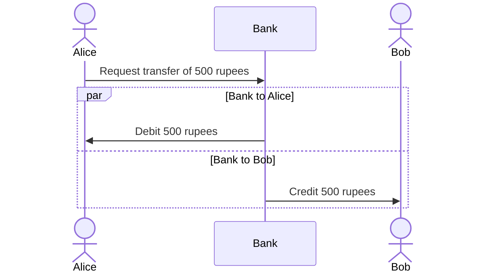
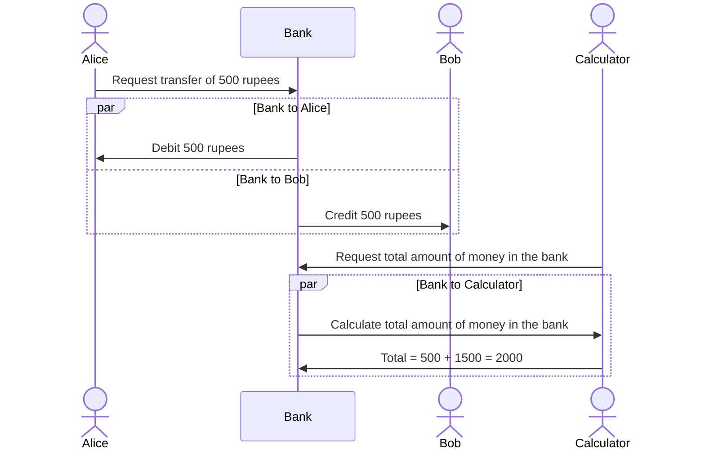
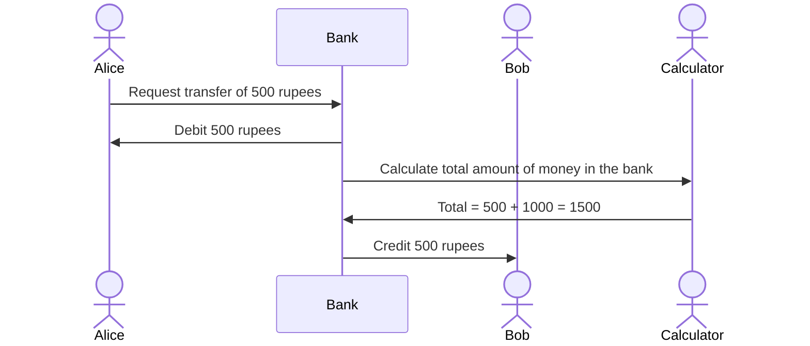

# Built-in functions - II and transactions

## Key Terms

### Transactions
> A set of logically related operation. A transaction is an action or series of actions. It is performed by a single user to perform operations for accessing the contents of the database.

### ACID properties
> ACID (atomicity, consistency, isolation, durability) is a set of properties of database transactions intended to guarantee data validity despite errors, power failures, and other mishaps

## Transactions
> A database transaction symbolizes a unit of work performed against a database, and treated in a coherent and reliable way independent of other transactions.

Transactions in a database environment have two main purposes:

* To provide reliable units of work that allow correct recovery from failures and keep a database consistent even in cases of system failure. 
* To provide isolation between programs accessing a database concurrently. If this isolation is not provided, the programs' outcomes are possibly erroneous.

Imagine a scenario where Alice has pay Bob 500 rupees.
Instead of paying each other directly, they use a bank.

Alice requests a payment to be made to Bob. The bank has to do two operations:
1. Deduce the amount to be paid to Bob from Alice's account.
2. Add the amount to be paid to Bob's account.
   


The above set of operations need to be performed in a single transaction else, in case of failure, the bank will be left in an inconsistent state.
For example, the debit operation succeeds but the credit operation fails.
Now Alice has 500 rupees less but Bob does not have 500 rupees more.

Some problems that can occur in the above set of operations are:
* The bank deducts money from Alice's account but the operation to Bob's account fails.
* Once the money is deducted from Alice's account, other processes will see the updated balance even if the credit operation fails.
* All the operations are successful, but the operation to write the data to the disk fails.


### ACID properties
A sequence of database operations that satisfies the ACID properties (which can be perceived as a single logical operation on the data) is called a transaction.


#### Atomicity
> Atomicity is the guarantee that series of database operations in an atomic transaction will either all occur (a successful operation), or none will occur (an unsuccessful operation)

If the logical transaction consists of transferring funds from Alice to Bob, this may be composed of 
- first removing the amount from account A, 
- then depositing the same amount in account B.
 
We would not want to see the amount removed from Alice before we are sure it has also been transferred into Bob. Then, until both transactions have happened, and the amount has been transferred to Bob, the logical transfer has not occurred.

Atomicity is maintained by databases using various features such as 
* `COMMIT` and `ROLLBACK` statements
* `auto-commit` mode

#### COMMIT and ROLLBACK

* To start a transaction, you can use the `START TRANSACTION` statement in MySQL. Other databases use similar statements like `BEGIN` and `BEGIN WORK`.
* Once you are done with your operations, you can use the `COMMIT` statement to store the changes in the database permanently.
* If you face an error or invalid state, you can use the `ROLLBACK` statement to cancel any changes you have made and return the database to its previous state.

Example transaction

```sql
-- Begin transaction
START TRANSACTION;

-- CHECK ALICE'S BALANCE
ALICE_BALANCE := READ(ALICE);
IF ALICE_BALANCE < 500 THEN
    ROLLBACK;
END IF;

-- DEBIT ALICE'S BALANCE
ALICE_BALANCE := ALICE_BALANCE - 500;
WRITE(ALICE, ALICE_BALANCE);

-- CREDIT BOB'S BALANCE
BOB_BALANCE := READ(BOB);
BOB_BALANCE := BOB_BALANCE + 500;
WRITE(BOB, BOB_BALANCE);

-- Commit transaction
COMMIT;
```

Atomicity is implemented in databases using the following two techniques:
  * `Write-ahead logging (WAL)` - All updates are written to a log file before they are committed to the database.
  * `Shadow paging` - During a transaction, the database keeps a copy of the database (pages). If the transaction is successful, the database will point to the copy (shadow page) as the current page. If the transaction fails, the database will point to the original page.

#### Consistency
* The integrity constraints are maintained so that the database is consistent before and after the transaction.
* The execution of a transaction will leave a database in either its prior stable state or a new stable state.
* The new state still maintains data integrity.


In the banking example of Alice and Bob, the total value of the accounts is 2000, split equally. Now if Alice transfers 500 rupees to Bob, the total value of the accounts should still be the same. 

But in case of credit failure, the total value will now be 1500 and hence the system will be left in an inconsistent state.

Other examples where consistency is not maintained are:
* Storing the balance as a negative number in the database.
* Storing the balance as a string in the database.
* Referencing a non-existent tuple in the database.

Databases ensure that the updated values are consistent with the structure of the table i.e. constraints, triggers and cascades but the correctness of the transaction must be ensured by the application.

#### Isolation
> Ensuring that the transaction will not be changed by any other concurrent transaction.

> Ensures that concurrent execution of transactions leaves the database in the same state that would have been obtained if the transactions were executed sequentially

> All the transactions will be carried out and executed as if it is the only transaction in the system

Let us consider two transactions. 
1. **T1** - Alice transfers 500 rupees to Bob. Alice and Bob both have 1000 rupees in their accounts.
2. **T2** - Calculate total amount of money in the bank.



If the two transactions execute sequentially, the calculator gets the correct amount i.e. Rs. 2000.
But what happens if the two transactions execute concurrently? Let us say the calculation happens after the money has been debited from Alice's account but not yet credited to Bob's account.



Due to the concurrent execution, the calculator gets the wrong amount i.e. Rs. 1500 instead of Rs. 2000.
Isolation property guards us against such inconsistent states by executing transactions in serial order. It guarantees that when multiple transactions execute concurrently, the end system state could be either of the states that could be achieved by executing transactions in some serial order.

#### Issues in concurrent transactions

##### Dirty Read

In a dirty read, a transaction reads uncommitted data from a concurrent transaction. This data might be reverted due to rollback of the transaction.


* T1 - Reads the data from the database.
* T1 - Writes the data to the database.
* T2 - Reads the data from the database. **Dirty Read**
* T1 - Rolls back the transaction. 


##### Dirty Write
Similar to Dirty Read, but in this case, the uncommited data is written to the database by the concurrent transaction.


* T1 - Reads the data from the database.
* T1 - Writes the data to the database.
* T2 - Reads the data from the database.
* T2 - Writes the data to the database. **Dirty Write**
* T1 - Commits the transaction.
* T2 - Rolls back the transaction.

##### Non-repeatable Read

A transaction tries to read uncommitted data from a concurrent transaction and gets different values for the same data each time.


* T1 - Reads the data from the database.
* T2 - Reads the data from the database.
* T2 - Writes the data to the database.
* T1 - Reads the data from the database. **Non-repeatable Read**
  
##### Phantom Read
> A phantom read occurs when, in the course of a transaction, new rows are added or removed by another transaction to the records being read.


* T1 - Reads the data from the database. (Gets 100 rows)
* T2 - Reads the data from the database. (Gets 100 rows)
* T2 - Adds a row to the database.
* T1 - Reads the data from the database. (Gets 101 rows) **Phantom Read**

#### Isolation levels

Isolation is typically defined at database level as a property that defines how or when the changes made by one operation become visible to others.

A lower isolation level increases the ability of many users to access the same data at the same time, but increases the number of concurrency effects (such as dirty reads or lost updates) users might encounter. Conversely, a higher isolation level reduces the types of concurrency effects that users may encounter, but requires more system resources and increases the chances that one transaction will block another.

##### Read Uncommitted
During a transaction uncommitted changes to an item in other transaction become visible immediately. Hence, all the concurrent transactions will see the same data and the concurrency issues listed above will still exist.

> This is the lowest isolation level and consequently, many side effects are present. Reads are not blocked by exclusive locks and do not need to take shared locks; in essence they can do whatever they want.


##### Read Committed

Transactions can only see committed data, or they are stopped from reading data that has been modified by other transactions but not yet committed. This is the default isolation level for `SQL Server`.

**It prevents P0 and P1 issues i.e. dirty writes and reads.**


* T1 - Reads the data from the database.
* T1 - Writes the data to the database.
* T2 - Reads the data from the database. **BLOCKED**
* T1 - Commits the transaction.
* T2 - **UNBLOCKED**

##### Repeatable Read
This isolation levels prevents the following operations:
* reading data that has been modified but not yet committed by other transactions. 
* modifying data that has been read by the current transaction until it has completed.


* T1 - Reads the data from the database.
* T2 - Reads the data from the database. (Allowed since read lock)
* T2 - Writes the data to the database. **BLOCKED**
* T1 - Reads the data from the database. (Same result)

Repeatable Read prevents the following issues:
* Dirty Write and Read (P0 and P1)
* Non-repeatable Read (P2)


##### Serializable

> The Serializable isolation level provides the strictest transaction isolation. This level emulates serial transaction execution for all committed transactions; as if transactions had been executed one after another, serially, rather than concurrently.


Basically, the transaction acquires a lock over the tables and hence other transactions cannot write to the tables until the transaction has committed.

Internally, this is implemented using Range locks.

> * Statements are prevented from reading data that has been modified but not yet committed by other transactions.
> * Transactions cannot modify data that has been read by the current transaction until the current transaction completes.
> * Other transactions aren’t allowed to insert new rows into a table read by the current transaction, if their key values fall in the range of keys read by any statements in the current transaction. So they are blocked until the current transaction completes.
> * Range locks are placed on the range of key values that match the search conditions of each statement executed in a transaction.

Serializable prevents phantom reads from happening.


* T1 - Reads the data from the database. (100 rows)
* T2 - Reads the data from the database. (Allowed due to shared lock)
* T2 - Writes the data to the database. **BLOCKED**
* T1 - Reads the data from the database. (100 rows)


**Cheat Sheet**


#### Durability
Durability in databases is the property that ensures transactions are saved permanently and do not accidentally disappear or get erased, even during a database crash.

> Guarantees that once a transaction has been committed, it will remain committed even in the case of a system failure (e.g., power outage or crash). 
> This usually means that completed transactions (or their effects) are recorded in non-volatile memory.

> Durability can be achieved by flushing the transaction's log records to non-volatile storage before acknowledging commitment.

> Many DBMSs implement durability by writing transactions into a transaction log that can be reprocessed to recreate the system state right before any later failure. A transaction is deemed committed only after it is entered in the log

---
