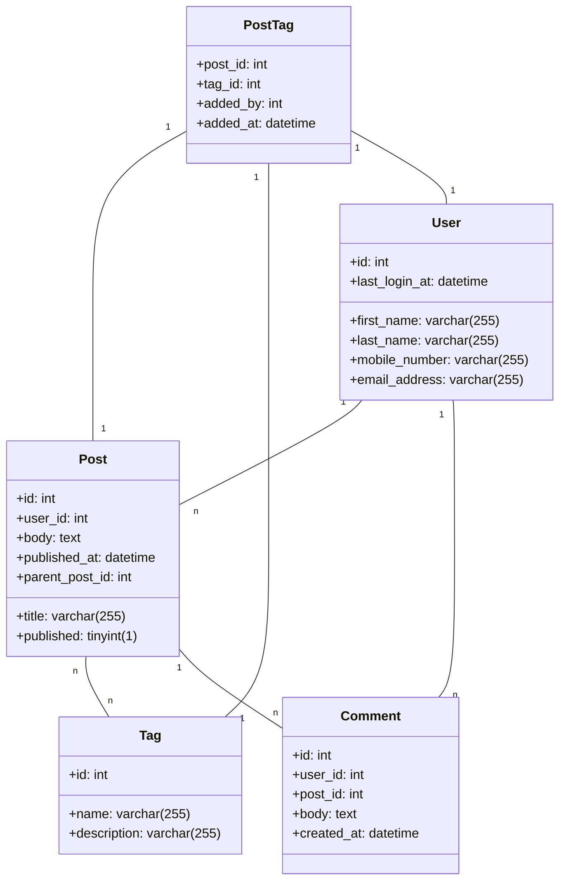
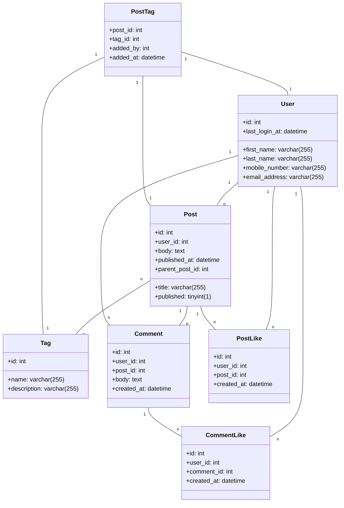

# Schema Design - Blog Management System

## Introduction


A blog is a website where people can post their thoughts and opinions. It is a great way to share information with the world. In this practice, we will design a database schema for a blog management system. The schema will be used to store information about users, posts, and comments.

## Requirements

1. The blog system will have multiple users.
2. Each user has a first name, a last name, a mobile number, an email address. 
3. For each user, we will store the date and time when the user last logged in.
4. Users can create multiple posts.
5. Each post has a title, a body, and a date and time when the post was published.
6. A user can also publish the post or keep it as a draft.
7. A post can also refer to a parent post. This is useful when a user wants to create a series of posts.
8. A post can have multiple tags.
9. Each tag should have a name and a description. We should also store who added the tag to the post and the time.
10. A user can comment on a post. 

## Entities

Identify the entities in the above requirements. For each entity, identify the attributes.

```
1. USER
    - first_name
    - last_name
    - mobile_number
    - email_address
    - last_login_at

2. POST
    - user
    - title
    - body
    - published
    - published_at
    - parent_post
    - tags
    - comments

3. TAG
    - name
    - description
    - added_by
    - added_at

4. COMMENT
    - user
    - post
    - body
    - created_at
```

## Relationships

Identify the relationships between the entities. For each relationship, identify the cardinality.

```
1. USER - POST
    - Entity 1: USER
    - Entity 2: POST
    - Cardinality: One to Many

2. POST - TAG
    - Entity 1: POST
    - Entity 2: TAG
    - Cardinality: Many to Many

3. POST - COMMENT
    - Entity 1: POST
    - Entity 2: COMMENT
    - Cardinality: One to Many

4. USER - COMMENT
    - Entity 1: USER
    - Entity 2: COMMENT
    - Cardinality: One to Many
```

## Tables

List all the tables that you will need to create for the above requirements. For each table, list the columns and their data types.

```
1. USERS
    - id: int (primary key)
    - first_name: varchar(255)
    - last_name: varchar(255)
    - mobile_number: varchar(255)
    - email_address: varchar(255)
    - last_login_at: datetime

2. POSTS
    - id: int (primary key)
    - user_id: int (foreign key)
    - title: varchar(255)
    - body: text
    - published: tinyint(1)
    - published_at: datetime
    - parent_post_id: int (foreign key)

3. TAGS
    - id: int (primary key)
    - name: varchar(255)
    - description: varchar(255)

4. POST_TAGS
    - post_id: int (foreign key)
    - tag_id: int (foreign key)
    - added_by: int (foreign key)
    - added_at: datetime
    Composite primary key: (post_id, tag_id)

5. COMMENTS
    - id: int (primary key)
    - user_id: int (foreign key)
    - post_id: int (foreign key)
    - body: text
    - created_at: datetime

```

## Schema diagram

Draw a schema diagram for the above requirements.



## New requirements

1. A user can like a post.
2. A user can also like a comment.
3. The system should also store the date and time when the user liked the post or comment.

Modify the above schema to add the above requirements.



