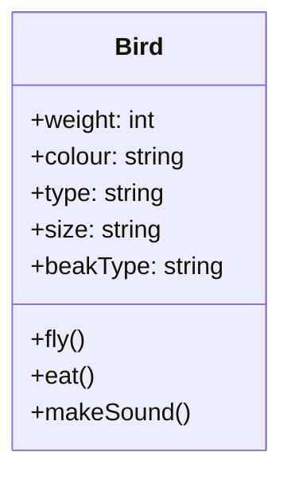

# Reflection and SOLID principles - SRP and OCP
- [Reflection and SOLID principles - SRP and OCP](#reflection-and-solid-principles---srp-and-ocp)
  - [Key terms](#key-terms)
    - [Reflection](#reflection)
    - [SOLID principles](#solid-principles)
    - [Single responsibility principle](#single-responsibility-principle)
    - [Open/closed principle](#openclosed-principle)
  - [Reflection](#reflection-1)
    - [Why not to use reflection?](#why-not-to-use-reflection)
  - [Single responsibility principle](#single-responsibility-principle-1)
    - [Case study - Design a bird](#case-study---design-a-bird)
    - [Reasons to follow SRP](#reasons-to-follow-srp)
    - [How/Where to spot violations of SRP?](#howwhere-to-spot-violations-of-srp)
    - [Side-assignment alert](#side-assignment-alert)
  - [Reading List](#reading-list)

## Key terms
### Reflection
> Reflection is the ability of a computer program to examine, introspect, and modify its own structure and behavior at runtime.

### SOLID principles
> SOLID is a mnemonic acronym for five design principles intended to make object-oriented designs more understandable, flexible, and maintainable. 

### Single responsibility principle
> There should never be more than one reason for a class/code unit to change. Every class should have only one responsibility.

### Open/closed principle
> Software entities (classes, modules, functions, etc.) should be open for extension, but closed for modification.
---
## Reflection

There are a few use cases where we need to construct objects without knowing their class at compile time. For example, we might want to create a new object based on the user input. In such cases, we can use reflection to create objects at runtime. Some use cases of reflection are:
* Creating new objects using their class name
* Getting the class name of an object
* Identifying the fields and methods of a class
* Identifying the annotations of a class

Let us take an example of the following class `Student`:

```java
public class Student {
    private String name;
    private int age;
    private String rollNumber;

    public Student(String name, int age, String rollNumber) {
        this.name = name;
        this.age = age;
        this.rollNumber = rollNumber;
    }

    public String getName() {
        return name;
    }

    public int getAge() {
        return age;
    }

    @Deprecated
    public String getRollNumber() {
        return rollNumber;
    }
}
```

We can create an object of the `Student` class and then use reflection to get the class name and the fields of the class.

```java
Student student = new Student("Tantia Tope", 25, "1234567890");
Field[] fields = student.getClass().getDeclaredFields();
```
In the above code, we are using the `getClass()` method to get the class of the object and then using the `getDeclaredFields()` method to get the fields of the class.

The `getDeclaredFields()` method returns an array of `Field` objects. The `Field` class is a part of the `java.lang.reflect` package. The `Field` class provides methods to get the name, type, and annotations of the field.

```java
for (Field field : fields) {
    System.out.println("Field name: " + field.getName());
    System.out.println("Field type: " + field.getType());
}
```

You can even get an instance of the class the reflection API.

```java
Class<?> studentClass = Class.forName("com.scaler.lld.rescaler.Student");
```

The `forName()` method of the `Class` class returns an instance of the `Class` class. The `forName()` method takes the fully qualified name of the class as an argument. The `forName()` method throws a `ClassNotFoundException` if the class is not found.

Similar to the `getDeclaredFields()` method, the `Class` class also provides methods to get the methods and annotations of the class.

```java
Method[] methods = studentClass.getDeclaredMethods();
for (Method method : methods) {
    System.out.println("Method name: " + method.getName());
    System.out.println("Method return type: " + method.getReturnType());
}
```

The `getDeclaredMethods()` method returns an array of `Method` objects. The `Method` class is a part of the `java.lang.reflect` package. The `Method` class provides methods to get the name, return type, and annotations of the method.

```java
Annotation[] annotations = studentClass.getDeclaredAnnotations();
for (Annotation annotation : annotations) {
    System.out.println("Annotation name: " + annotation.annotationType());
}
```

### Why not to use reflection?

Reflection is a very powerful tool, but it should be used with caution.
1. Reflection is a very slow process and should be avoided in performance-critical applications.
2. Reflection is also not type-safe. If you are using reflection to access a field or method, you will not get any compile-time error if the field or method does not exist. You will get a runtime error instead.
3. Reflection also makes the code difficult to understand and debug.
4. Reflection can also be used to access private fields and methods. This can lead to security issues. It can also be used to modify the behavior of a class at runtime. This can lead to unexpected behavior.
5. It is brittle. If you change the name of a field or method, you will have to change the code that uses reflection to access that field or method.

---
## Single responsibility principle

> When designing our classes, we should aim to put related features together, so whenever they tend to change they change for the same reason. And we should try to separate features if they will change for different reasons.

<p align="center">
    
</p>

The Single Responsibility Principle states that a class should do one thing, and therefore it should have only a single reason to change. Only one potential change (database logic, logging logic, and so on.) in the software’s specification should be able to affect the specification of the class.

This means that if a class is a data container, like a Book class or a Student class, and it has some fields regarding that entity, it should change only when we change the data model.

### Case study - Design a bird

To understand the SOLID principles, let us take the help of a bird. A bird is a living creature that can fly, eat, and make a sound. How can we design a bird?

The simplest solution would be to create a `Bird` class with different attributes and methods. A bird could have the following attributes:
* Weight
* Colour
* Type
* Size
* BeakType

A bird would also exhibit the following behaviours:
* Fly
* Eat
* Make a sound



The `Bird` class would look as follows:
    
```java
public class Bird {
    private int weight;
    private String colour;
    private String type;
    private String size;
    private String beakType;

    public void fly() {
        ...
    }

    public void eat() {
        ...
    }

    public void makeSound() {
        ...
    }
}
```

In order to understand the design further, let us try to implement the `fly` method.
Since each bird has a different method of flying, we would have to implement conditional statements to check the type of the bird and then call the appropriate method.

```java
public void fly() {
    if (type.equals("eagle")) {
        flyLikeEagle();
    } else if (type.equals("penguin")) {
        flyLikePenguin();
    } else if (type.equals("parrot")) {
        flyLikeParrot();
    }
}
```

The above code exhibits the following problems:
* `Readability` - The code is not readable. It is difficult to understand what the code is doing.
* `Testing` - It is difficult to test the code. We would have to test each type of bird separately.
* `Reusability` - The code is not reusable. If we want to re-use the code of specific type of bird, we would have to change the above code.
* `Parallel development` - The code is not parallel development friendly. If multiple developers are working on the same code, they could face merge conflicts.
* `Multiple reasons to change` - The code has multiple reasons to change. If we want to change the way a type of bird flies, we would have to change the code in the `fly` method.


### Reasons to follow SRP
Apart from overcoming the problems mentioned above, there are other reasons to follow the SRP:
* Maintainability - Smaller, well-organized classes are easier to search than monolithic ones.
* Ease of testing – A class with one responsibility will have far fewer test cases.
* Lower coupling – Less functionality in a single class will have fewer dependencies.

### How/Where to spot violations of SRP?
* A method with multiple `if-else` statements. An example would be the `fly` method of the `Bird` class. This is not a silver bullet, but it is a good indicator. There can be other reasons for multiple `if-else` statements such as business logic e.g. calculating the tax, checking access rights, etc.
* `Monster methods` or `God classes` - Methods that are too long and doing much more than the name suggests. This is a good indicator of a violation of SRP.

```java
public saveToDatabase() {
    // Connect to database
    // Create a query
    // Execute the query
    // Create a user defined object
    // Close the connection
}
```
The above method is doing much more than the name suggests. It is connecting to the database, creating a query, executing the query, creating a user defined object, and closing the connection. This method violates the SRP. It should be split into multiple methods such as `connectToDatabase`, `createQuery`, `executeQuery`, `createUserDefinedObject`, and `closeConnection`.
* `Utility classes` - Utility classes are classes that contain only static methods which are used to perform some utility functions. Have a look at the utility package of Java [here](https://docs.oracle.com/javase/8/docs/api/java/util/package-summary.html). There is just way too many responsibilities of this package.

### Side-assignment alert
* Identify the violations of SRP in [this](../code/src/../oop/src/main/java/com/scaler/lld/questions/Invoice.java) class.
* Refactor the code to follow SRP.

--- 

## Reading List
* [SOLID vs CUPID vs GRASP](https://www.boldare.com/blog/solid-cupid-grasp-principles-object-oriented-design/#what-is-solid-and-why-is-it-more-than-just-an-acronym?-solid-vs.-cupid---is-the-new-always-better?)
* [Java and SRP](https://medium.com/swlh/java-packages-and-the-single-responsibility-principle-a23e151719d1)