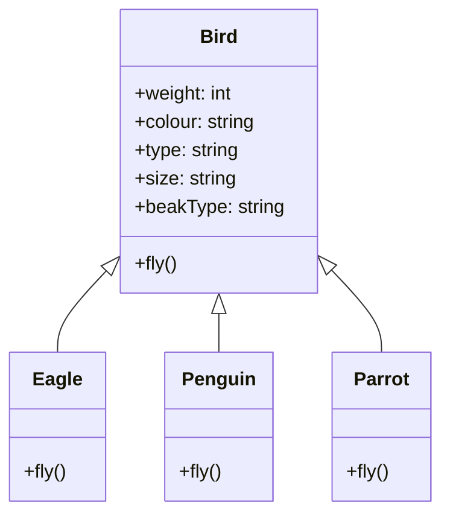
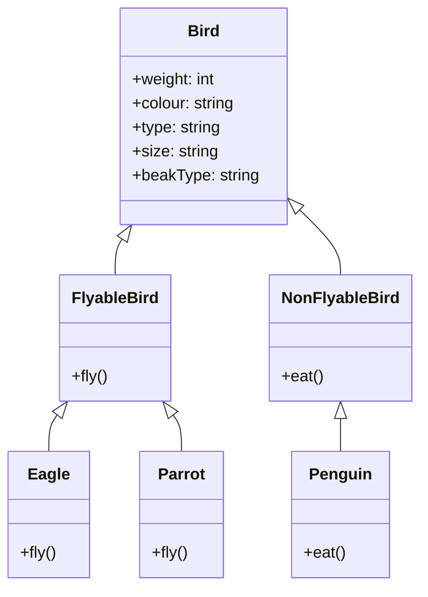
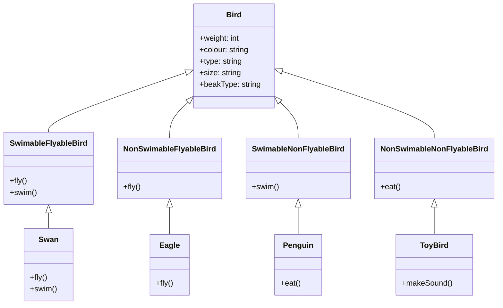
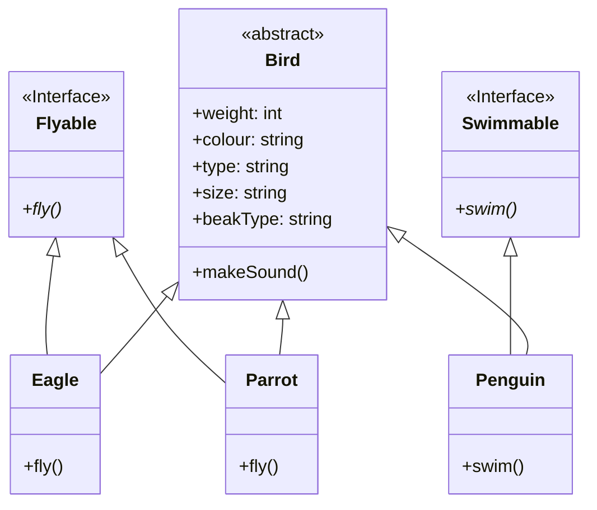

# SOLID principles - Liskov, Interface Segregation, and Dependency Inversion
- [SOLID principles - Liskov, Interface Segregation, and Dependency Inversion](#solid-principles---liskov-interface-segregation-and-dependency-inversion)
  - [Key Terms](#key-terms)
    - [Liskov Substitution Principle](#liskov-substitution-principle)
    - [Interface Segregation Principle](#interface-segregation-principle)
    - [Dependency Inversion Principle](#dependency-inversion-principle)
  - [Open/closed principle](#openclosed-principle)
    - [Fixing OCP violation in the `Bird` class](#fixing-ocp-violation-in-the-bird-class)
  - [Liskov Substitution Principle](#liskov-substitution-principle-1)
    - [Creating new abstract classes](#creating-new-abstract-classes)
    - [Creating new interfaces](#creating-new-interfaces)
    - [Summary](#summary)
  - [Interface Segregation Principle](#interface-segregation-principle-1)
  - [Reading list](#reading-list)

## Key Terms
### Liskov Substitution Principle
> Objects in a program should be replaceable with instances of their subtypes without altering the correctness of that program.

### Interface Segregation Principle
> Many client-specific interfaces are better than one general-purpose interface.

### Dependency Inversion Principle
> Depend upon abstractions. Do not depend upon concrete classes.
---

## Open/closed principle
We identified a bunch of problems with the `Bird` class. Let us see the fly method again to spot another problem.

```java
public void fly() {
    if (type.equals("eagle")) {
        flyLikeEagle();
    } else if (type.equals("penguin")) {
        flyLikePenguin();
    } else if (type.equals("parrot")) {
        flyLikeParrot();
    }
}
```

In the above code, we are checking the type of the bird and then calling the appropriate method. If we want to add a new type of bird, we would have to change the code in the `fly` method. This is a violation of the Open/Closed Principle.

<p align="center">
    
</p>

**The Open/Closed Principle states that a class should be open for extension but closed for modification. This means that we should be able to add new functionality to the class without changing the existing code.** To add a new feature, we should ideally create a new class or method and have very little or no changes in the existing code.
In doing so, we stop ourselves from modifying existing code and causing potential new bugs in an otherwise happy application. We should be able to add new functionality without touching the existing code for the class. This is because whenever we modify the existing code, we are taking the risk of creating potential bugs. So we should avoid touching the tested and reliable (mostly) production code if possible.

* A module will be said to be open if it is still available for extension. For example, it should be possible to add fields to the data structures it contains, or new elements to the set of functions it performs.
* A module will be said to be closed if [it] is available for use by other modules. This assumes that the module has been given a well-defined, stable description (the interface in the sense of information hiding).

### Fixing OCP violation in the `Bird` class

Now that we have learnt about abstract classes and interfaces, let us fix the SRP and OCP violation in the `Bird` class. In order to fix the SRP violations, we would consider having a parent class `Bird` and child classes `Eagle`, `Penguin`, and `Parrot`. Since, different birds have the same attributes and behaviours, we would want to use classes. An instance of the `Bird` class does not make sense, hence we would use an abstract class. We can't use an interface since we would want to have instance variables. We would also want to have a fixed contract for the subclasses to implement the common functionalities. Hence, we would use an abstract class.
Now, our `Bird` class would look like this.



## Liskov Substitution Principle

Let us take a look at our final version of the `Bird` class from [the last session](https://github.com/kanmaytacker/fundamentals/blob/master/oop/notes/04-solid-01.md#fixing-ocp-violation-in-the-bird-class). We started with a `Bird` class which had SRP and OCP violations. We now have a `Bird` abstract class which can be extended by the `Eagle`, `Penguin` and `Parrot` subclasses.


We have also added a `fly()` method to the `Bird` class. All the subclasses of `Bird` have to implement this method. A penguin cannot fly, yet we have added a `fly()` method to the `Penguin` class. How can we handle this?
* `Dummy method` - We can add a dummy method to the `Penguin` class which does nothing.
* `Return null`
* `Throw an exception`

In the above methods, we are trying to force a contract on a class which does not follow it. If we try to use a `Penguin` object in a place where we expect a `Bird` object, we could have unexpected outcomes. For example, if we call the `fly()` method on a `Penguin` object, we would get an exception. This is not what we want. We want to be able to use a `Penguin` object in a place where we expect a `Bird` object. We want to be able to call the `fly()` method on a `Penguin` object and get the same result as if we had called it on a `Sparrow` object. This is where the Liskov Substitution Principle comes into play.

```java
List<Bird> birds = List.of(new Eagle(), new Penguin(), new Parrot());
for (Bird bird : birds) {
    bird.fly();
}
```
This is a violation of the Liskov Substitution Principle. The Liskov Substitution Principle states that objects in a program should be replaceable with instances of their subtypes without altering the correctness of that program. In other words, if we have a `Bird` object, we should be able to replace it with an instance of its subclasses without altering the correctness of the program. In our case, we cannot replace a `Bird` object with a `Penguin` object because the `Penguin` object requires special handling.


### Creating new abstract classes

A way to solve the issue with the `Penguin` class is to create a new set of abstract classes, `FlyableBird` and `NonFlyableBird`. The `FlyableBird` class will have the `fly()` method and the `NonFlyableBird` class will not have the `fly()` method. The `Penguin` class will extend the `NonFlyableBird` class and the `Eagle` and `Parrot` classes will extend the `FlyableBird` class. This way, we can ensure that the `Penguin` class does not have to implement the `fly()` method.



This is an example of multi-level inheritance. The issue with the above approach is that we are tying behaviour to the class hierarchy. If we want to add a new type of behaviour, we will have to add a new abstract class. For instance if we can have birds that can swim and birds that cannot swim, we will have to create a new abstract class `SwimableBird` and `NonSwimableBird` and add them to the class hierarchy. But now how do you extends from two abstract classes? You can't. Then we would have to create classes with composite behaviours such as `SwimableFlyableBird` and `SwimableNonFlyableBird`.



If we want to add a new type of behaviour, we will have to add a new abstract class. This is why we should not tie behaviour to the class hierarchy.

### Creating new interfaces

We can solve the issue with the `Penguin` class by creating new interfaces. We can create an `Flyable` interface and an `Swimmable` interface. The `Penguin` class will implement the `Swimmable` interface and the `Eagle` and `Parrot` classes will implement the `Flyable` interface. This way, we can ensure that the `Penguin` class does not have to implement the `fly()` method.



Since we are not tying behaviour to the class hierarchy, we can add new types of behaviour without having to add new abstract classes. For instance, if we want to add a new type of behaviour, we can create a new interface `CanSing` and add it to the class hierarchy.

### Summary
* The Liskov Substitution Principle states that objects in a program should be replaceable with instances of their subtypes without altering the correctness of that program.
* To identify violations, we can check if we can replace a class with its subclasses having to handle special cases and expect the same behaviour.
* Prefer using interfaces over abstract classes to implement behaviour since abstract classes tend to tie behaviour to the class hierarchy.

## Interface Segregation Principle

Segregation means keeping things separated, and the Interface Segregation Principle is about separating the interfaces.

The principle states that many client-specific interfaces are better than one general-purpose interface. Clients should not be forced to implement a function they do no need. Declaring methods in an interface that the client doesn’t need pollutes the interface and leads to a “bulky” or “fat” interface


A client should never be forced to implement an interface that it doesn’t use, or clients shouldn’t be forced to depend on methods they do not use. In other words, we should not create fat interfaces. A fat interface is an interface that has too many methods. If we have a fat interface, we will have to implement all the methods in the interface even if we don’t use them. This is known as the interface segregation principle. 

Let us take the example of our `Bird` class. To not tie the behaviour to the class hierarchy, we created an interface `Flyable` and implemented it in the `Eagle` and `Parrot` classes.

```java
public interface Flyable {
    void fly();
    void makeSound();
}
```
Along with the `fly()` method, we also have the `makeSound()` method in the `Flyable` interface. This is because the `Eagle` and `Parrot` classes both make sounds when they fly. But what if we have a class that implements the `Flyable` interface? The class does not make a sound when it flies. This is a violation of the interface segregation principle. We should not have the `makeSound()` method in the `Flyable` interface.

Larger interfaces should be split into smaller ones. By doing so, we can ensure that implementing classes only need to be concerned about the methods that are of interest to them. If a class exposes so many members that those members can be broken down into groups that serve different clients that don’t use members from the other groups, you should think about exposing those member groups as separate interfaces.

Precise application design and correct abstraction is the key behind the Interface Segregation Principle. Though it'll take more time and effort in the design phase of an application and might increase the code complexity, in the end, we get a flexible code.

---

## Reading list
* [LSP](http://web.archive.org/web/20151128004108/http://www.objectmentor.com/resources/articles/lsp.pdf)
* [SOLID - Recap](https://www.cs.odu.edu/~zeil/cs330/latest/Public/solid/)