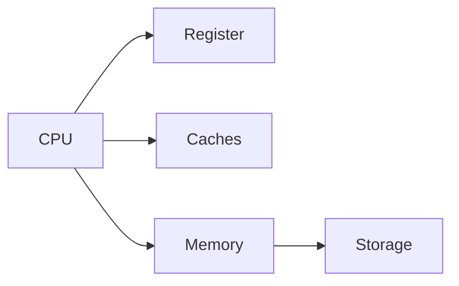

# Deadlocks and memory management

## Agenda
* Concurrent data structures
* Deadlocks
* Memory management
  * How are processes stored in memory?
  * Fragmentation
  * Paging and MMU
  * Page faults
  * Thrashing
  * Belady's anomaly

## Deadlocks

A deadlock in OS is a situation in which more than one process is blocked because it is holding a resource and also requires some resource that is acquired by some other process.

### Conditions for a deadlock
* `Mutual exclusion` - The resource is held by only one process at a time and cannot be acquired by another process.
* `Hold and wait` - A process is **holding** a resource and **waiting** for another resource to be released by another a process.
* `No preemption` - The resource can only be released once the execution of the process is complete.
* `Circular wait` - A set of processes are waiting for each other circularly. Process `P1` is waiting for process `P2` and process `P2` is waiting for process `P1`.

Process P1 and P2 are in a deadlock because:
* Resources are non-shareable. (Mutual exclusion)
* Process 1 holds "Resource 1" and is waiting for "Resource 2" to be released by process 2. (Hold and wait)
* None of the processes can be preempted. (No preemption)
* "Resource 1" and needs "Resource 2" from Process 2 while Process 2 holds "Resource 2" and requires "Resource 1" from Process 1. (Circular wait)

### Tackling deadlocks

There are three ways to tackle deadlocks:
* Prevention - Implementing a mechanism to prevent the deadlock.
* Avoidance - Avoiding deadlocks by not allocating resources when deadlocks are possible.
* Detecting and recovering - Detecting deadlocks and recovering from them.
* Ignorance - Ignore deadlocks as they do not happen frequently.

#### Prevention and avoidance

Deadlock prevention means to block at least one of the four conditions required for deadlock to occur. If we are able to block any one of them then deadlock can be prevented. Spooling and non-blocking synchronization algorithms are used to prevent the above conditions. In deadlock prevention all the requests are granted in a finite amount of time.

In Deadlock avoidance we have to anticipate deadlock before it really occurs and ensure that the system does not go in unsafe state.It is possible to avoid deadlock if resources are allocated carefully. For deadlock avoidance we use Banker’s and Safety algorithm for resource allocation purpose. In deadlock avoidance the maximum number of resources of each type that will be needed are stated at the beginning of the process. 

#### Detecting and recovering from deadlocks

We let the system fall into a deadlock and if it happens, we detect it using a detection algorithm and try to recover.

Some ways of recovery are as follows:

* Aborting all the deadlocked processes.
* Abort one process at a time until the system recovers from the deadlock.
* Resource Preemption: Resources are taken one by one from a process and assigned to higher priority processes until the deadlock is resolved.

#### Ignorance

The system assumes that deadlock never occurs. Since the problem of deadlock situation is not frequent, some systems simply ignore it. Operating systems such as UNIX and Windows follow this approach. However, if a deadlock occurs we can reboot our system and the deadlock is resolved automatically.

#### Tackling deadlocks at an application level
* Set timeouts for all the processes. If a process does not respond within the timeout period, it is killed.
* Implementing with caution: Use interfaces that handle or provide callbacks if locks are held by other processes.
* Add timeout to locks: If a process requests a lock, and it is held by another process, it will wait for the lock to be released until the timeout expires.

## Memory management

A computer's operations are handled by the CPU while the major of the data storage is the non-volatile disk memory or storage. The volatile memory is the main memory of the computer or the RAM. 

The CPU cannot access the non-volatile disk memory directly since the storage is much slower than the CPU. Applications are stored in the disk memory. On executing an application, the process is loaded into the RAM and the CPU can access the RAM directly.

## How are processes stored in memory?

Contiguous Memory Allocation is a type of memory allocation technique where processes are allotted a continuous block of space in memory. This block can be of fixed size for all the processes in a fixed size partition scheme or can be of variable size depending on the requirements of the process in a variable size partition scheme.

Each process is allotted a fixed size continuous block in the main memory. That means there will be continuous blocks of fixed size into which the complete memory will be divided, and each time a process comes in, it will be allotted one of the free blocks. Because irrespective of the size of the process, each is allotted a block of the same size memory space. This technique is also called static partitioning.

The advantages of a fixed-size partition scheme are:

* Because all the blocks are the same size, this scheme is simple to implement. All we have to do now is divide the memory into fixed blocks and assign processes to them.
* It is easy to keep track of how many blocks of memory are left, which in turn decides how many more processes can be given space in the memory.
* As at a time multiple processes can be kept in the memory, this scheme can be implemented in a system that needs multiprogramming.

Though the fixed-size partition scheme has many advantages, it also has some disadvantages:

* As the size of the blocks is fixed, we will not be able to allot space to a process that has a greater size than the block.
* The size of the blocks decides the degree of multiprogramming, and only that many processes can remain in the memory at once as the number of blocks.
* If the size of the block is greater than the size of the process, we have no other choice but to assign the process to this block, but this will lead to much empty space left behind in the block. This empty space could've been used to accommodate a different process. This is called internal fragmentation. Hence, this technique may lead to space wastage.

### Fragmentation

A Fragmentation is defined as when the process is loaded and removed after execution from memory, it creates a small free hole. These holes can not be assigned to new processes because holes are not combined or do not fulfil the memory requirement of the process.  To achieve a degree of multiprogramming, we must reduce the waste of memory or fragmentation problem. In operating system two types of fragmentation:

#### Internal fragmentation

Internal fragmentation occurs when memory blocks are allocated to the process more than their requested size. Due to this some unused space is leftover and creates an internal fragmentation problem.

Suppose there is a fixed partitioning is used for memory allocation and the different size of block 3MB, 6MB, and 7MB space in memory. Now a new process p4 of size 2MB comes and demand for the block of memory. It gets a memory block of 3MB but 1MB block memory is a waste, and it can not be allocated to other processes too. This is called internal fragmentation.

#### External fragmentation

In external fragmentation, we have a free memory block, but we can not assign it to process because blocks are not contiguous.

Example: Suppose (consider above example) three process p1, p2, p3 comes with size 2MB, 4MB, and 7MB respectively. Now they get memory blocks of size 3MB, 6MB, and 7MB allocated respectively. After allocating process p1 process and p2 process left 1MB and 2MB. Suppose a new process p4 comes and demands a 3MB block of memory, which is available, but we can not assign it because free memory space is not contiguous.  This is called external fragmentation.

## Paging
> a type of memory management technique that uses non-contiguous memory allocation to store data

Paging is a technique that divides memory into fixed-sized blocks. The main memory is divided into blocks known as Frames and the logical memory is divided into blocks known as Pages. Paging requires extra time for the address conversion, so we use a special hardware cache memory known as TLB.

Paging is a fixed-sized memory allocation, storage, and management scheme. Paging does two types of memory division:

* The main memory is divided into small fixed-sized blocks of physical memory which are known as Frames. The main memory can be referred to as the Collection of Frames.
* The logical or Secondary Memory is divided into small fixed-sized blocks which are known as Pages

The size of a frame is the same as that of a page so that pages can be easily loaded into frames. The same size of frames and pages also help to maximize the memory and the CPU utilization. Paging keeps track of all the free frames of main memory and loads the pages of secondary memory or processes for the CPU to work with.

There are two types of addresses:
* Physical Address: The physical address is the address of the physical memory (Disk).
* Logical Address: The logical address is the address of the logical memory (RAM).

Page Table is a kind of mapping data structure used to store the mapping between the logical address and the physical address. Page tables are stored in the Kernel-owned physical memory. The page table contains the base address of each page. This base address is then combined with the page offset to get the physical memory address.

### Advantages of paging
* Paging allows the data to be stored in a non-contiguous manner.
* Paging helps to solve the external fragmentation issue because the frame size is the same as the page size; hence, a page can be easily loaded into a frame without any loss of data.
* Swapping of pages is easy due to the same size.
* Paging is also a very simple algorithm for memory management.
* With the help of TLB cache, Paging is even faster.

### Disadvantages of paging
* Without the use of TLB or in case of TLB miss, the page access time (time to translate address) is large.
* Paging requires a large memory space as the page table is also stored in the main memory.
* Paging avoids external fragmentation but there is still the issue of internal fragmentation because the page has a fixed size, but a process may request more or less space.
### Page Fault and Page Replacement algorithms

A Page Fault occurs when a program running in CPU tries to access a page that is in the address space of that program, but the requested page is currently not loaded into the main physical memory, the RAM of the system.

Since the actual RAM is much less than the virtual memory the page faults occur. So whenever a page fault occurs, the Operating system has to replace an existing page in RAM with the newly requested page. In this scenario, page replacement algorithms help the Operating System in deciding which page to replace. The primary objective of all the page replacement algorithms is to minimize the number of page faults.

There are various page replacement algorithms available in Operating Systems. The most common page replacement algorithms are:
* FIFO: First in First out.
* LRU: Least Recently Used.
* Optimal: Optimal page replacement is the best page replacement algorithm as this algorithm results in the least number of page faults. In this algorithm, the pages are replaced with the ones that will not be used for the longest duration of time in the future. In simple terms, the pages that will be referred farthest in the future are replaced in this algorithm

#### Thrashing

In multiprogramming, there can be a scenario when the system spends most of its time shuttling pages between the main memory and the secondary memory due to frequent page faults. This behavior is known as thrashing.

A process is said to be thrashing if the CPU spends more time serving page faults than executing the pages. This leads to low CPU utilization and the Operating System in return tries to increase the degree of multiprogramming.

Refer to [this](https://www.scaler.com/topics/thrashing-in-os/) for detailed explanation.

#### Belady's Anomaly

A page fault occurs when a page is not found in the memory and needs to be loaded from the disk. If a page fault occurs and all memory frames have been already allocated, then replacement of a page in memory is required on the request of a new page. This is referred to as demand-paging. The choice of which page to replace is specified by page replacement algorithms. The commonly used page replacement algorithms are FIFO, LRU, optimal page replacement algorithms, etc. 

Generally, on increasing the number of frames to a process’ virtual memory, its execution becomes faster as fewer page faults occur. Sometimes the reverse happens, i.e. more page faults occur when more frames are allocated to a process. This most unexpected result is termed Belady’s Anomaly. 

Belady’s anomaly is the name given to the phenomenon where increasing the number of page frames results in an increase in the number of page faults for a given memory access pattern. 

The page replacement algorithms in which Belady’s Anomaly occurs the most includes:

* First In First Out (FIFO)
* Second Chance Algorithm
* Random Page Replacement Algorithm
 
 **dcbadcedcbae**

