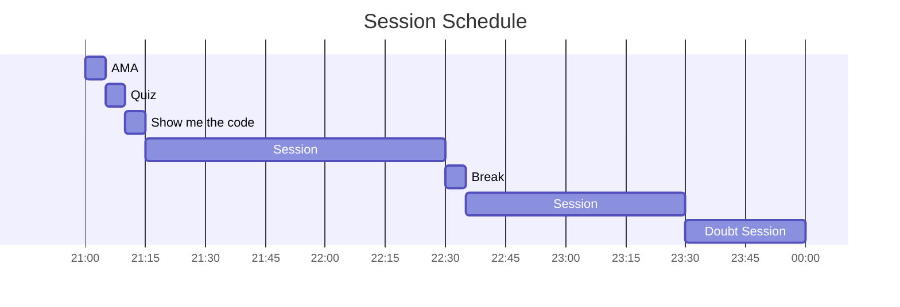

```mermaid
gantt
    title Session Schedule
    dateFormat HH:mm
    axisFormat %H:%M
    AMA           : a1, 21:00, 5m
    Quiz          : a2, after a1, 5m
    Show me the code : a3, after a2, 5m
    Session      : a4, after a3, 75m
    Break         : a5, 22:30, 5m
    Session      : a6, after a5, 23:30
    Doubt Session : a7, 23:30, 30m
```